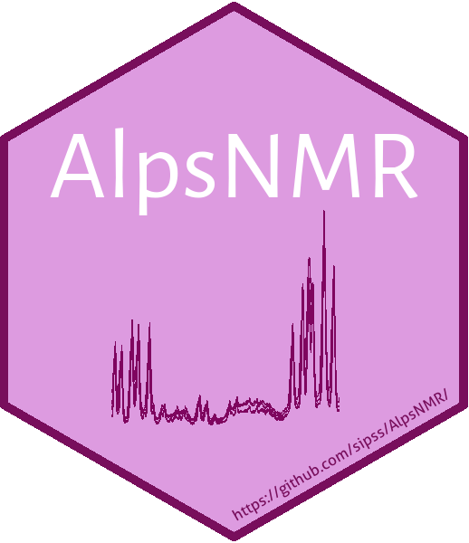

# AlpsNMR 

[](https://github.com/sipss/AlpsNMR/actions/)
[](https://codecov.io/github/sipss/AlpsNMR)
[](https://bioconductor.org/checkResults/devel/bioc-LATEST/AlpsNMR/)
[](https://sipss.github.io/AlpsNMR/)
[](https://doi.org/10.1093/bioinformatics/btaa022)

`AlpsNMR` is an R package that can load Bruker and JDX samples as well as
preprocess them.

It includes functions for region exclusion, normalization, peak detection & integration and
outlier detection among others. See the package vignette for details.

## Installation

```r
if (!"BiocManager" %in% rownames(installed.packages()))  
    install.packages("BiocManager")
BiocManager::install("AlpsNMR")
```

## Alternative installation

AlpsNMR can be installed with the `devtools` package. For this is needed
Rtools and note that it uses packages from
CRAN, from BioConductor and from git repositories:

If you already have Rtools, follow this to install AlpsNMR:

```r
if (!"BiocManager" %in% rownames(installed.packages()))  
    install.packages("BiocManager")  
BiocManager::install(c("MassSpecWavelet", "impute"), update = FALSE)  
if (!"devtools" %in% rownames(installed.packages()))  
    install.packages("devtools")  
devtools::install_github("sipss/AlpsNMR")
```

If you need install Rtools:
Follow steps of Rtools website [[Rtools web](https://cran.r-project.org/bin/windows/Rtools/)]

Don't forget the additional step, Putting Rtools on the PATH.

Install AlpsNMR:

```r
if (!"BiocManager" %in% rownames(installed.packages()))  
    install.packages("BiocManager")  
BiocManager::install(c("MassSpecWavelet", "impute"), update = FALSE)  
if (!"devtools" %in% rownames(installed.packages()))  
    install.packages("devtools")  
devtools::install_github("sipss/AlpsNMR")
```

Quick start
=============

Checkout the [Introduction to AlpsNMR](https://sipss.github.io/AlpsNMR/articles/introduction-to-alpsnmr.html) vignette that shows how to import data and preprocess it using `AlpsNMR`. See our [publication](https://doi.org/10.1093/bioinformatics/btaa022) for further details.

See also the [tutorial](https://github.com/sipss/AlpsNMR-Tutorial) with a real dataset from beginning to end, including all the steps of untargeted metabolomics analysis.
