# Introduction to AlpsNMR

Abstract

An introduction to the AlpsNMR package, showing the most relevant
functions and a proposed workflow. This includes loading bruker NMR
samples, adding sample annotations, preprocessing the spectra, detecting
outliers, detecting peaks, aligning the samples and integrating the
peaks to build a peak table.

## Getting started

The `AlpsNMR` package has most of its functions prefixed with `nmr_`.
The main reason for this is to avoid conflicts with other packages.
Besides, it helps for autocompletion: Most coding environments such as
RStudio will let you see most of the function names by typing `nmr_`
followed by pressing the tab key.

This vignette assumes some basic knowledge of NMR and data analysis, and
some basic R programming.

We will start by loading `AlpsNMR` along some convenience packages:

``` r

library(dplyr)
```

    ## 
    ## Attaching package: 'dplyr'

    ## The following objects are masked from 'package:stats':
    ## 
    ##     filter, lag

    ## The following objects are masked from 'package:base':
    ## 
    ##     intersect, setdiff, setequal, union

``` r

library(ggplot2)
library(readxl)
library(BiocParallel)
library(AlpsNMR)
```

    ## 
    ## Attaching package: 'AlpsNMR'

    ## The following object is masked from 'package:stats':
    ## 
    ##     filter

## Enable parallellization

This package is able to parallellize several functions through the use
of the `BiocParallel` package. Whether to parallelize or not is left to
the user that can control the parallellization registering backends.
Please check
[`vignette("Introduction_To_BiocParallel", package = "BiocParallel")`](https://bioconductor.org/packages/release/bioc/vignettes/BiocParallel/inst/doc/Introduction_To_BiocParallel.html).

``` r

#register(SerialParam(), default = TRUE)  # disable parallellization
register(SnowParam(workers = 2, exportglobals = FALSE), default = TRUE)  # enable parallellization with 2 workers
```

## Data: The `MeOH_plasma_extraction` dataset

To explore the basics of the AlpsNMR package, we have included three NMR
samples acquired in a 600 MHz Bruker instrument bundled with the
package. The samples are pooled quality control plasma samples, that
were extracted with methanol. They only contain small molecules.

If you have installed this package, you can obtain the directory where
the samples are with the command:

``` r

MeOH_plasma_extraction_dir <- system.file("dataset-demo", package = "AlpsNMR")
MeOH_plasma_extraction_dir
```

    ## [1] "/__w/_temp/Library/AlpsNMR/dataset-demo"

The demo directory includes three zipped Bruker samples and a dummy
Excel metadata file:

``` r

list.files(MeOH_plasma_extraction_dir)
```

    ## [1] "10.zip"              "20.zip"              "30.zip"             
    ## [4] "dummy_metadata.xlsx" "README.txt"

Since these are quality control samples, the metadata is a dummy table:

``` r

MeOH_plasma_extraction_xlsx <- file.path(MeOH_plasma_extraction_dir, "dummy_metadata.xlsx")
annotations <- readxl::read_excel(MeOH_plasma_extraction_xlsx)
annotations
```

    ## # A tibble: 3 × 3
    ##   NMRExperiment SubjectID TimePoint
    ##   <chr>         <chr>     <chr>    
    ## 1 10            Ana       baseline 
    ## 2 20            Ana       3 months 
    ## 3 30            Elia      baseline

## Loading samples

The function to read samples is called
[`nmr_read_samples()`](https://sipss.github.io/AlpsNMR/reference/nmr_read_samples.md).
It expects a character vector with the samples to load that can be paths
to directories of Bruker format samples or paths to JDX files.

Additionally, this function can filter by pulse sequences (e.g. load
only NOESY samples) or loading only metadata.

``` r

zip_files <- fs::dir_ls(MeOH_plasma_extraction_dir, glob = "*.zip")
zip_files
```

    ## /__w/_temp/Library/AlpsNMR/dataset-demo/10.zip
    ## /__w/_temp/Library/AlpsNMR/dataset-demo/20.zip
    ## /__w/_temp/Library/AlpsNMR/dataset-demo/30.zip

``` r

dataset <- nmr_read_samples(sample_names = zip_files)
dataset
```

    ## An nmr_dataset (3 samples)

If your samples happen to be in different **folders per class**, AlpsNMR
provides convenience functions to read them as well. With this example:

    - your_dataset/
      + control/
         * 10/
         * 20/
         * 30/
      + mutated/
         * 10/
         * 20/
         * 30/

You could use:

    dataset <- nmr_read_samples_dir(c("your_dataset/control", "your_dataset/mutated"))
    dataset

If after reading the
[`?nmr_read_samples`](https://sipss.github.io/AlpsNMR/reference/nmr_read_samples.md)
page you still have issues, feel free to open an issue at
<https://github.com/sipss/AlpsNMR/issues> and ask for clarification.

## Adding annotations

We can embed the external annotations we loaded above into the dataset:

``` r

dataset <- nmr_meta_add(dataset, metadata = annotations, by = "NMRExperiment")
```

And retrieve them from the dataset:

``` r

nmr_meta_get(dataset, groups = "external")
```

    ## # A tibble: 3 × 3
    ##   NMRExperiment SubjectID TimePoint
    ##   <chr>         <chr>     <chr>    
    ## 1 10            Ana       baseline 
    ## 2 20            Ana       3 months 
    ## 3 30            Elia      baseline

If you want to learn more about sample metadata (including acquisition
and FID processing parameters), as well as more complex ways of adding
annotations, check out the
[`vignette("Vig02-handling-metadata-and-annotations", package = "AlpsNMR")`](https://sipss.github.io/AlpsNMR/articles/Vig02-handling-metadata-and-annotations.md).

## Phasing

It might be the case that automatically reconstructed metabolite NMR
spectra have a first-order phase error. AlpsNMR provides a convenient
wrapper function the `NMRphasing` package, offering a variety of
algorithms to estimate and correct for phase errors, which arise on
physical grounds.

``` r

#dataset <- nmr_autophase(dataset, method="MPC_DANM")
```

## Interpolation

1D NMR samples can be interpolated together, in order to arrange all the
spectra into a matrix, with one row per sample. Here we choose the range
of ppm values that we want to include in further analyses.

``` r

dataset <- nmr_interpolate_1D(dataset, axis = c(min = -0.5, max = 10))
```

If the `axis = NULL` then the ppm axis is autodetected from the samples.

See
[`nmr_interpolate_1D()`](https://sipss.github.io/AlpsNMR/reference/nmr_interpolate_1D.md)
for further reference on the axis options.

## Plotting samples

Plotting many spectra with so many points is quite expensive so it is
possible to include only some regions of the spectra or plot only some
samples.

``` r

plot(dataset, NMRExperiment = c("10", "30"), chemshift_range = c(2.2, 2.8))
```

## Exclude regions

Some regions can easily be excluded from the spectra with
[`nmr_exclude_region()`](https://sipss.github.io/AlpsNMR/reference/nmr_exclude_region.md):

``` r

regions_to_exclude <- list(water = c(4.6, 5), methanol = c(3.33, 3.39))
dataset <- nmr_exclude_region(dataset, exclude = regions_to_exclude)
plot(dataset, chemshift_range = c(4.2, 5.5))
```

## Filter samples

Maybe we just want to analyze a subset of the data, e.g., only a class
group or a particular gender. We can filter some samples according to
their metadata as follows:

``` r

samples_10_20 <- filter(dataset, SubjectID == "Ana")
nmr_meta_get(samples_10_20, groups = "external")
```

    ## # A tibble: 2 × 3
    ##   NMRExperiment SubjectID TimePoint
    ##   <chr>         <chr>     <chr>    
    ## 1 10            Ana       baseline 
    ## 2 20            Ana       3 months

## Robust PCA for outlier detection

The AlpsNMR package includes robust PCA analysis for outlier detection.

``` r

pca_outliers_rob <- nmr_pca_outliers_robust(dataset, ncomp = 3)
nmr_pca_outliers_plot(dataset, pca_outliers_rob)
```

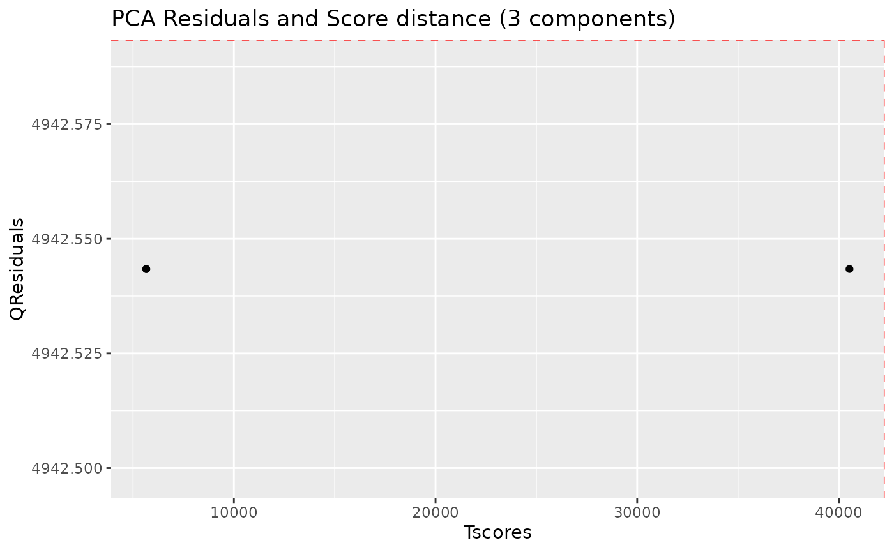

Samples with greater QResiduals and Tscores than the threshold defined
by the red line are candidates for further exploration and exclusion.
With this small dataset, there is not much to see.

## Baseline estimation

Spectra may display an unstable baseline, specially when processing
blood/fecal samples.

The peak detection and integration algorithms benefit from having an
estimation of the baseline, so it is advisable to compute it first and
check it fits as expected.

See before:

``` r

plot(dataset, chemshift_range = c(1.37, 2.5))
```

``` r

plot(dataset, chemshift_range = c(3.5,3.8))
```

Estimate the baseline:

``` r

dataset <- nmr_baseline_estimation(dataset, lambda = 9, p = 0.01)
```

And after:

``` r

# TODO: Simplify this plot
spectra_to_plot <- tidy(dataset, chemshift_range = c(1.37, 2.5))
baseline_to_plot <- tidy(dataset, chemshift_range = c(1.37, 2.5), matrix_name = "data_1r_baseline")

ggplot(mapping = aes(x = chemshift, y = intensity, color = NMRExperiment)) +
    geom_line(data = spectra_to_plot) +
    geom_line(data = baseline_to_plot, linetype = "dashed") + 
    facet_wrap(~NMRExperiment, ncol = 1)
```

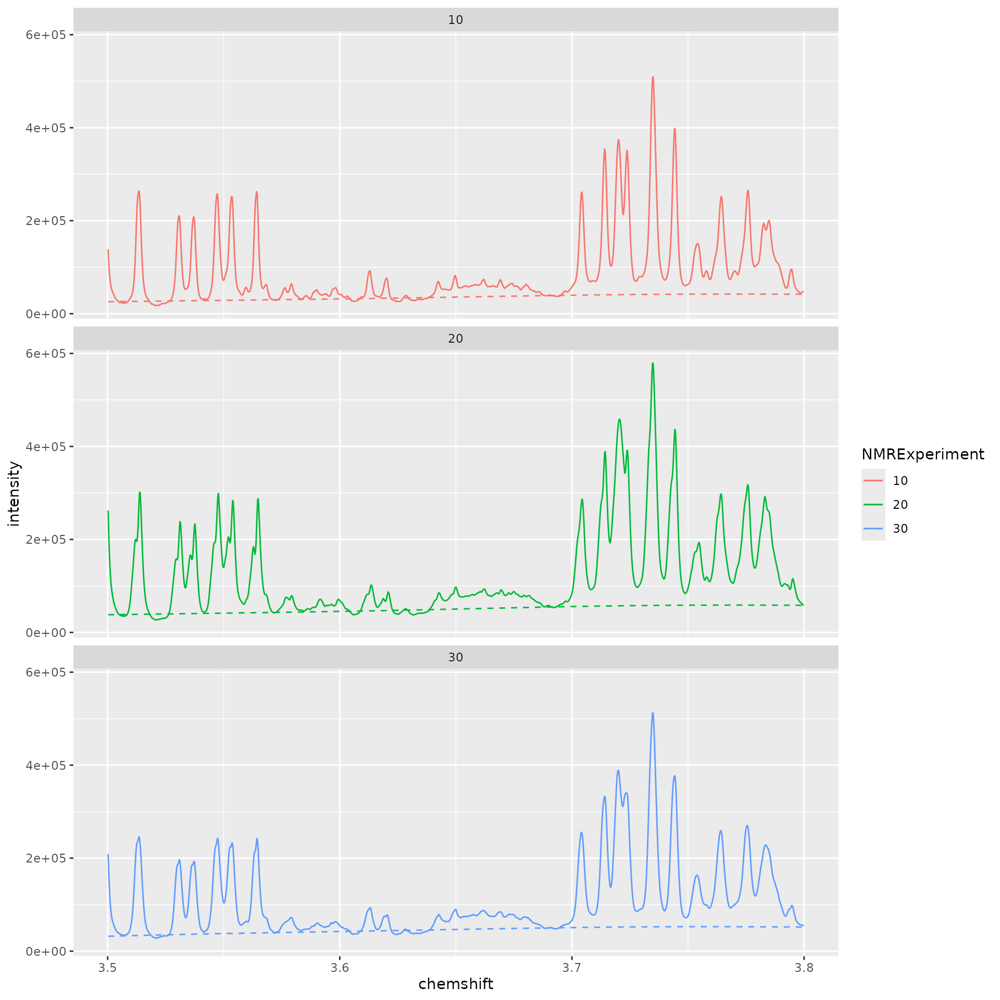

``` r

# TODO: Simplify this plot
spectra_to_plot <- tidy(dataset, chemshift_range = c(3.5, 3.8))
baseline_to_plot <- tidy(dataset, chemshift_range = c(3.5, 3.8), matrix_name = "data_1r_baseline")

ggplot(mapping = aes(x = chemshift, y = intensity, color = NMRExperiment)) +
    geom_line(data = spectra_to_plot) +
    geom_line(data = baseline_to_plot, linetype = "dashed") + 
    facet_wrap(~NMRExperiment, ncol = 1)
```


## Peak detection

The peak detection is performed on short spectra segments using a
continuous wavelet transform. Peaks below a threshold intensity are
automatically discarded.

Our current approach relies on the use of the baseline threshold
(`baselineThresh`) automatically calculated (see
[`?nmr_baseline_threshold`](https://sipss.github.io/AlpsNMR/reference/nmr_baseline_threshold.md))
and the Signal to Noise Threshold (`SNR.Th`) to discriminate valid peaks
from noise.

See
[`?nmr_detect_peaks`](https://sipss.github.io/AlpsNMR/reference/nmr_detect_peaks.md)
for more information.

``` r

baselineThresh <- nmr_baseline_threshold(dataset, range_without_peaks = c(9.5, 10), method = "median3mad")
nmr_baseline_threshold_plot(dataset, baselineThresh, chemshift_range = c(9.5, 10))
```

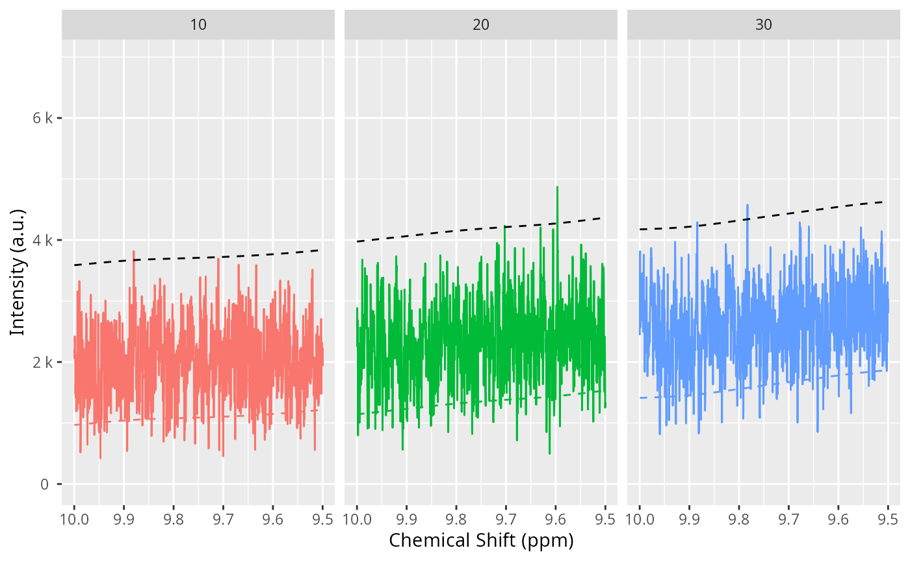

``` r

peak_list_initial <- nmr_detect_peaks(
    dataset,
    nDivRange_ppm = 0.1,
    scales = seq(1, 16, 2),
    baselineThresh = baselineThresh,
    SNR.Th = 3,
    fit_lorentzians = TRUE
)
```

We can get an overview of the number of peaks we detect on each sample
and each chemical shift region:

``` r

nmr_detect_peaks_plot_overview(peak_list_initial)
```

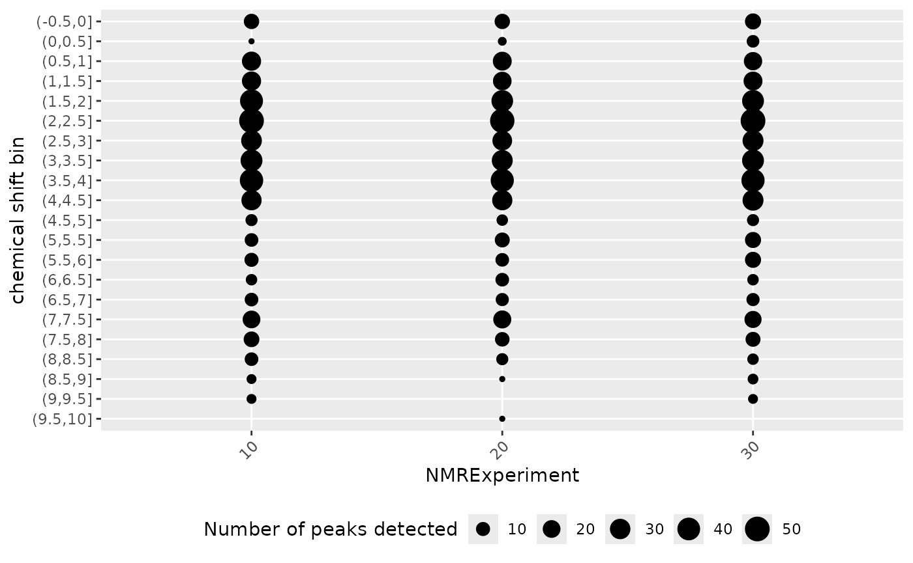

We can explore in a more detailed way the detected peaks:

``` r

nmr_detect_peaks_plot(dataset, peak_list_initial, NMRExperiment = "10", chemshift_range = c(3, 3.3))
```

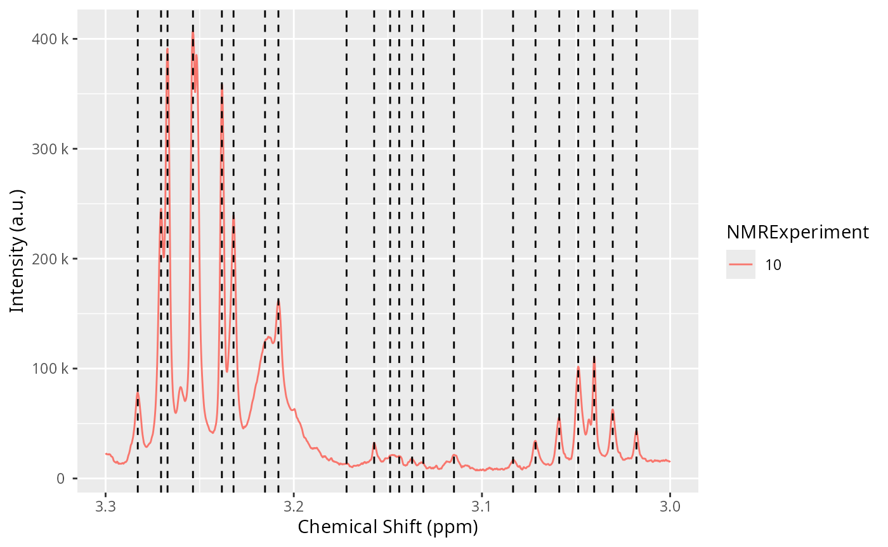

Let’s the detected peaks in a smaller region across samples:

``` r

peak_list_in_range <- filter(peak_list_initial, ppm > 3.22, ppm < 3.24)
peak_list_in_range
```

    ## # A tibble: 6 × 11
    ##   peak_id  NMRExperiment   ppm   pos intensity_raw intensity ppm_infl_min
    ##   <chr>    <chr>         <dbl> <dbl>         <dbl>     <dbl>        <dbl>
    ## 1 Peak0211 10             3.23 16281       239459.   224420.         3.23
    ## 2 Peak0212 10             3.24 16308       358753.   343534.         3.24
    ## 3 Peak0603 20             3.23 16283       291094.   267693.         3.23
    ## 4 Peak0604 20             3.24 16309       399656.   375897.         3.24
    ## 5 Peak1002 30             3.23 16281       243670.   232273.         3.23
    ## 6 Peak1003 30             3.24 16308       464835.   453429.         3.24
    ## # ℹ 4 more variables: ppm_infl_max <dbl>, gamma_ppb <dbl>, area <dbl>,
    ## #   norm_rmse <dbl>

``` r

plot(dataset, chemshift_range = c(3.22, 3.25))
```

``` r

nmr_detect_peaks_plot_peaks(
    dataset,
    peak_list_initial,
    peak_ids = peak_list_in_range$peak_id,
    caption = paste("{peak_id}",
                    "(NMRExp.\u00A0{NMRExperiment},",
                    "gamma(ppb)\u00a0=\u00a0{gamma_ppb},",
                    "\narea\u00a0=\u00a0{area},",
                    "nrmse\u00a0=\u00a0{norm_rmse})")
)
```

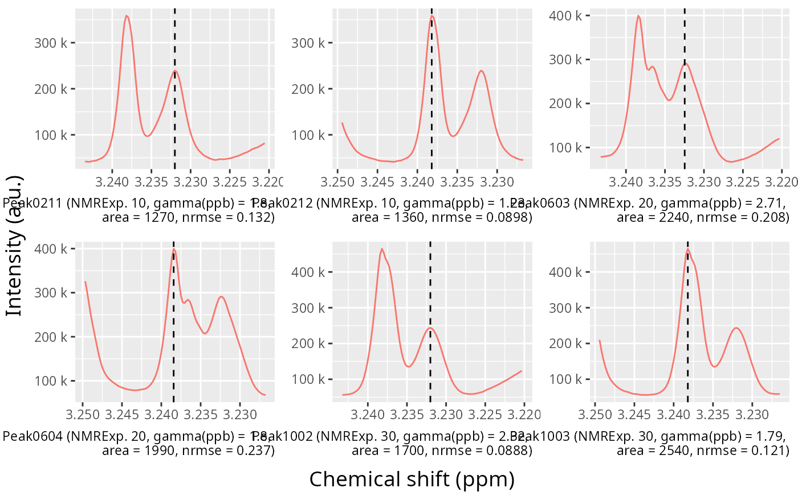

``` r

peak_list_initial_accepted <- peaklist_accept_peaks(
    peak_list_initial,
    dataset,
    area_min = 50, 
    keep_rejected = FALSE,
    verbose = TRUE
)
```

    ## Acceptance report
    ## ℹ 833/1127 peaks accepted. (73.9%)
    ## ℹ Removing 294 peaks

## Spectra alignment

Once we have a preliminary peak list, we can align the spectra using the
[`nmr_align()`](https://sipss.github.io/AlpsNMR/reference/nmr_align.md)
function. We expect shifts between the spectra, this becomes necessary
so we can cluster the peaks correctly afterwards and build a peak table.

The alignment process takes several parameters, including:

- `NMRExp_ref`: An NMRExperiment with a reference sample. Usually it
  should be a pool of all samples if it is available. Otherwise, you can
  use
  [`nmr_align_find_ref()`](https://sipss.github.io/AlpsNMR/reference/nmr_align_find_ref.md)
  to find a sample. Depending on how heterogeneous your dataset is,
  there may not be a good reference sample (even if the function picks
  one, the alignment might not succeed), so please always check the
  results afterwards.

- `maxShift_ppm`: The maximum shift allowed when aligning the spectra.

- `acceptLostPeak`: Set it to `TRUE` if you want to accept some peaks
  getting lost during the alignment process. Since the peak detection is
  never perfect, it is reasonable to accept some lost peaks.

``` r

NMRExp_ref <- nmr_align_find_ref(dataset, peak_list_initial_accepted)
message("Your reference is NMRExperiment ", NMRExp_ref)
```

    ## Your reference is NMRExperiment 20

``` r

dataset_align <- nmr_align(
    nmr_dataset = dataset, 
    peak_data = peak_list_initial_accepted, 
    NMRExp_ref = NMRExp_ref, 
    maxShift_ppm = 0.0015, 
    acceptLostPeak = TRUE
)
```

Compare the dataset before and after alignment, to verify the quality of
the alignment:

``` r

plot(dataset, chemshift_range = c(3.025, 3.063))
plot(dataset_align, chemshift_range = c(3.025, 3.063))
```

``` r

cowplot::plot_grid(
    plot(dataset, chemshift_range = c(3.22, 3.25)) + theme(legend.position = "none"),
    plot(dataset_align, chemshift_range = c(3.22, 3.25)) + theme(legend.position = "none")
)
```

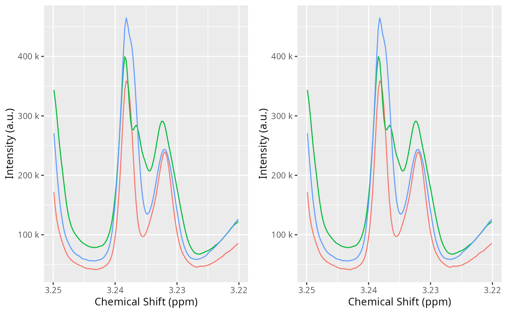

## Normalization

With the spectra correctly aligned, you can use spectra normalization
techniques. We normalize after alignment because some of the
normalization techniques are sensitive to misalignments.

There are multiple normalization techniques available. The most strongly
recommended is the Probabilistic Quantile Normalization (`pqn`), but it
requires more samples for its internal estimations to be reliable, as it
needs a computation of the median spectra. Nevertheless, it is possible
to compute it:

``` r

dataset_norm <- nmr_normalize(dataset_align, method = "pqn")
```

    ## Warning: There are not enough samples for reliably estimating the median spectra
    ## ℹ The Probabalistic Quotient Normalization requires several samples to compute the median spectra. Your number of samples is low
    ## ℹ Review your peaks before and after normalization to ensure there are no big distortions

The normalization essentially computes a normalization factor for each
sample.

The plot shows the dispersion with respect to the median of the
normalization factors, and can highlight samples with abnormally large
or small normalization factors.

``` r

normalization_info <- nmr_normalize_extra_info(dataset_norm)
normalization_info$norm_factor
```

    ##   NMRExperiment norm_factor norm_factor_norm
    ## 1            10   0.8478185        0.8478185
    ## 2            20   1.1417458        1.1417458
    ## 3            30   1.0000000        1.0000000

``` r

normalization_info$plot
```

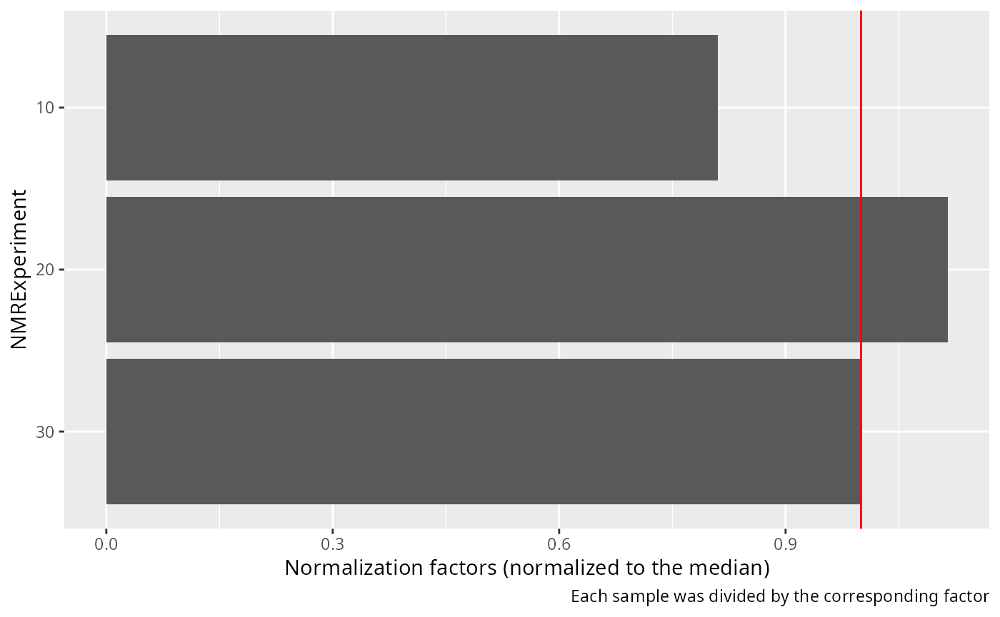

We can confirm sample 20 is now slightly more diluted:

``` r

to_plot <- dplyr::bind_rows(
    tidy(dataset_align, NMRExperiment = "20", chemshift_range = c(2,2.5)) %>%
        mutate(Normalized = "No"),
    tidy(dataset_norm, NMRExperiment = "20", chemshift_range = c(2,2.5)) %>%
        mutate(Normalized = "Yes"),
)
ggplot(data = to_plot, mapping = aes(x = chemshift, y = intensity, color = Normalized)) + 
    geom_line() +
    scale_x_reverse() +
    labs(y = "Intensity", x = "Chemical shift (ppm)",
         caption = "The normalization slightly diluted experiment 20")
```

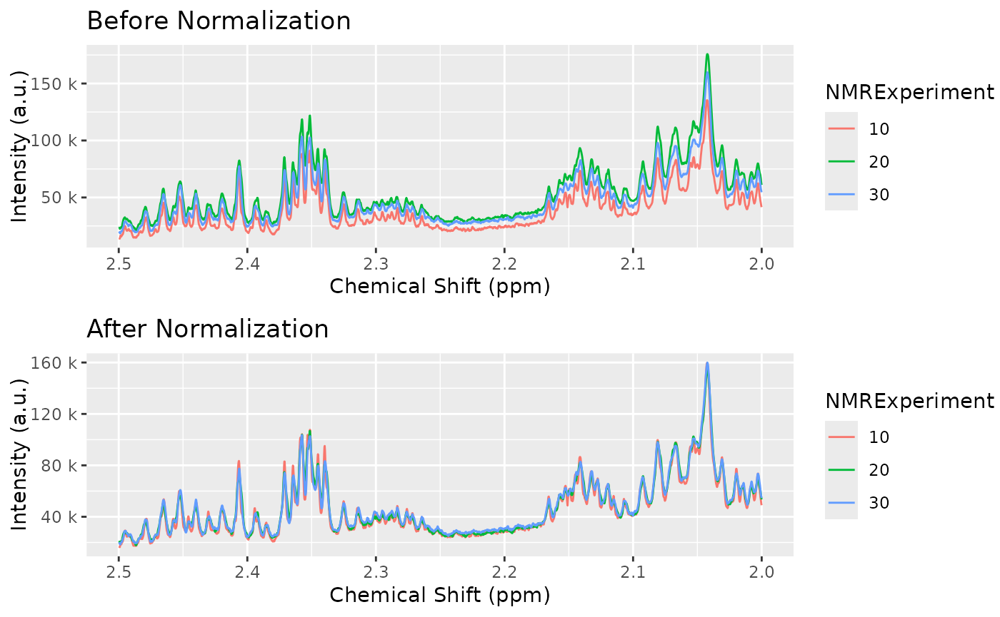

And all samples are more homogeneous now:

``` r

cowplot::plot_grid(
    plot(dataset_align, chemshift_range = c(2, 2.5)) + labs(title="Before Normalization"),
    plot(dataset_norm, chemshift_range = c(2, 2.5)) + labs(title="After Normalization"),
    ncol = 1
)
```

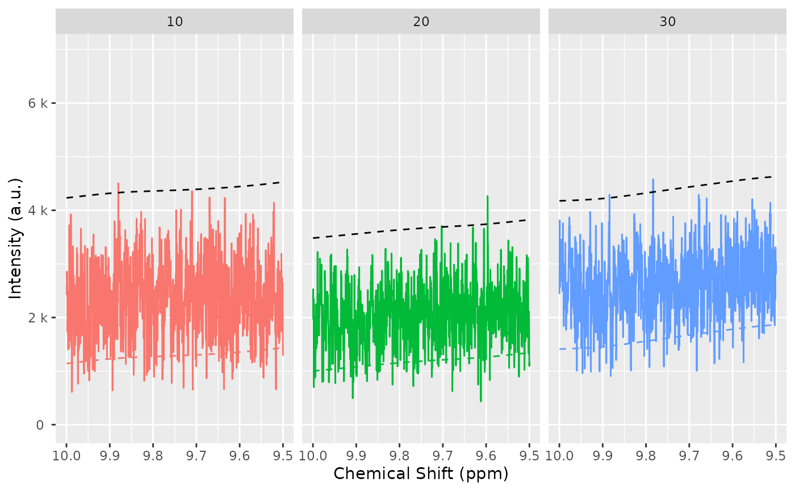

## Peak grouping

If you align or normalize your samples, you should rerun the peak
detection to ensure the peak positions and estimations are well
calculated:

``` r

baselineThresh <- nmr_baseline_threshold(dataset_norm, range_without_peaks = c(9.5, 10), method = "median3mad")
nmr_baseline_threshold_plot(dataset_norm, baselineThresh, chemshift_range = c(9.5, 10))
```


``` r

peak_list_for_clustering_unfiltered <- nmr_detect_peaks(
    dataset_norm,
    nDivRange_ppm = 0.1,
    scales = seq(1, 16, 2),
    baselineThresh = baselineThresh,
    SNR.Th = 3,
    fit_lorentzians = TRUE,
    verbose = TRUE
)

peak_list_for_clustering <- peaklist_accept_peaks(
    peak_list_for_clustering_unfiltered,
    dataset_norm,
    area_min = 50, 
    keep_rejected = FALSE,
    verbose = TRUE
)
```

    ## Acceptance report
    ## ℹ 837/1128 peaks accepted. (74.2%)
    ## ℹ Removing 291 peaks

Feel free to plot, explore and further curate your peak list. Or proceed
with the current one:

Once we have a peak list for each sample `peak_list`, we need to turn it
into a table, merging peaks from different samples together.

``` r

clustering <- nmr_peak_clustering(peak_list_for_clustering, verbose = TRUE)
```

    ## ℹ The maximum distance between two peaks in the same cluster is of 7.6
    ## ppbs

``` r

cowplot::plot_grid(
    clustering$num_cluster_estimation$plot + labs(title = "Full"),
    clustering$num_cluster_estimation$plot +
        xlim(clustering$num_cluster_estimation$num_clusters-50, clustering$num_cluster_estimation$num_clusters+50) +
        ylim(0, 10*clustering$num_cluster_estimation$max_dist_thresh_ppb) +
        labs(title = "Fine region")
)
```

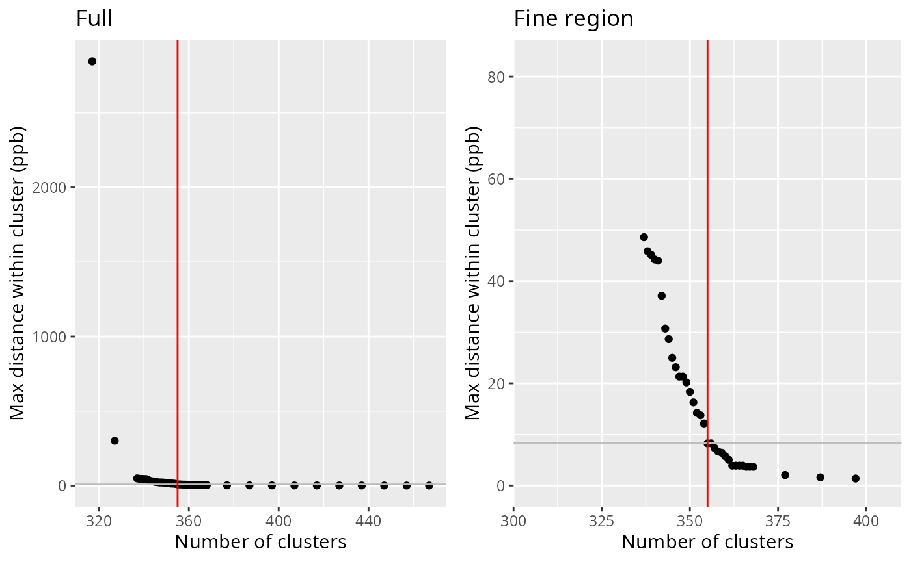

``` r

peak_list_clustered <- clustering$peak_data
```

We can plot the samples, with the detected peaks and how they have been
connected. This allows us to compare the peak detection across samples,
and check how good the peak matching is.

If peaks are matched they are connected with a black segment. If peaks
are detected but not matched, they appear as a dot. If you see a peak,
without a point on top then it means the peak was not detected or it was
filtered out.

``` r

nmr_peak_clustering_plot(
    dataset = dataset_norm,
    peak_list_clustered = peak_list_clustered,
    NMRExperiments = c("10", "20"),
    chemshift_range = c(2.4, 3.0)
)
```

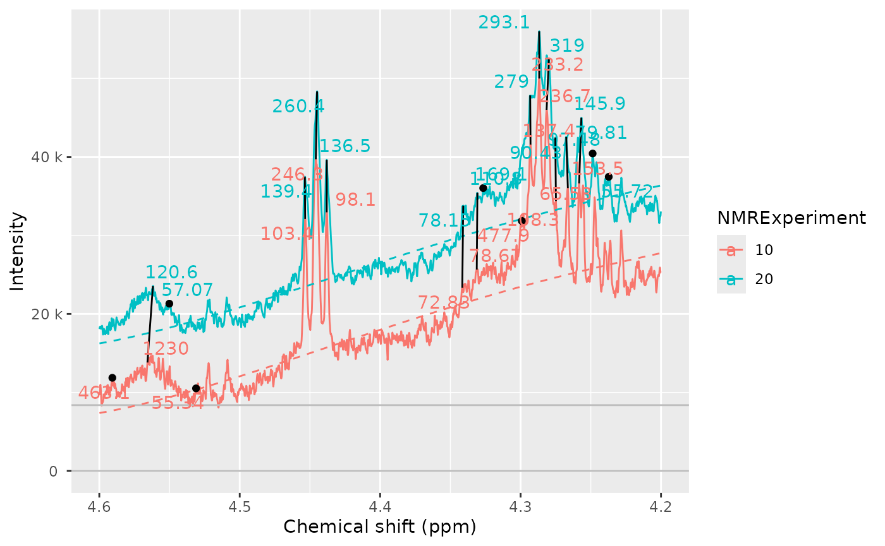

Sometimes we see peaks and we wonder why are they not detected. We can
include the `baselineThresh` to plot it in the sample as well. This can
help to diagnose if the `baselineThresh` argument is the cause of a peak
not being detected.

``` r

nmr_peak_clustering_plot(
    dataset_norm,
    peak_list_clustered, 
    NMRExperiments = c("10", "20"),
    chemshift_range = c(4.2, 4.6),
    baselineThresh = baselineThresh
)
```

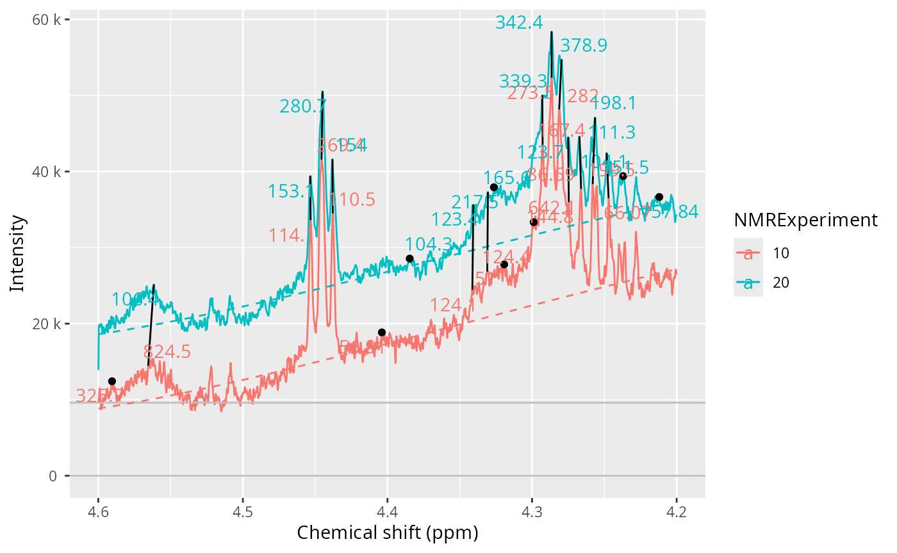

``` r

peak_table <- nmr_build_peak_table(peak_list_clustered, dataset_norm)
peak_table
```

    ## An nmr_dataset_peak_table (3 samples, and 327 peaks)

``` r

peak_matrix <- nmr_data(peak_table)
peak_matrix[1:3, 1:8]
```

    ##      0.8119   0.8223   0.8247    0.8333    0.8447   0.8479    0.8553   0.8605
    ## 10 248.1267       NA       NA  576.0143  583.9753 584.6623  234.5596 316.6228
    ## 20 411.9895 1448.242 651.2340 1062.1772 1039.3439       NA 1628.4974 426.1569
    ## 30 286.1166       NA 963.8636  886.4543  859.2278       NA 1761.5356 574.4400

Or you can get a data frame with the corresponding annotations:

``` r

peak_table_df <- as.data.frame(peak_table)
peak_table_df
```

    ##    NMRExperiment SubjectID TimePoint   0.8119   0.8223   0.8247    0.8333
    ## 10            10       Ana  baseline 248.1267       NA       NA  576.0143
    ## 20            20       Ana  3 months 411.9895 1448.242 651.2340 1062.1772
    ## 30            30      Elia  baseline 286.1166       NA 963.8636  886.4543
    ##       0.8447   0.8479    0.8553   0.8605   0.8656   0.8729   0.8784   0.8910
    ## 10  583.9753 584.6623  234.5596 316.6228 789.1244 293.0063 464.0081 294.2186
    ## 20 1039.3439       NA 1628.4974 426.1569 754.8023 485.4725 704.8556 622.1860
    ## 30  859.2278       NA 1761.5356 574.4400 881.7160 544.6912 513.5834 463.6449
    ##      0.9034   0.9087   0.9158   0.9197   0.9314   0.9437   0.9554    0.9658
    ## 10 350.8436 341.2886 319.6393 299.8821 299.5249 363.8845 703.9568  937.0603
    ## 20 719.4185 585.6042       NA 464.9987 456.8718 534.5573 869.8690 1325.2469
    ## 30 562.9421 539.3869 597.7612 484.1953 447.1456 510.5058 808.2868 1111.3046
    ##      0.9758    0.9903   1.0020   1.0091   1.0208   1.0409   1.0526    1.0595
    ## 10 602.7438  752.4888 760.9498 264.6978 228.0143 686.4252 683.5871  84.61342
    ## 20 843.1016 1010.4784 999.9029 330.4955 295.2787 925.4050 917.6458        NA
    ## 30 679.3239  940.9196 927.1883 330.1383 273.9946 830.3180 831.3827 126.11231
    ##       1.0717   1.1749   1.1870   1.1980   1.2085   1.2179   1.2294   1.2366
    ## 10  57.54959       NA 566.4997 655.1246  913.711 1421.560 1582.320 2743.867
    ## 20 184.61314 461.9956       NA 929.4432 1477.699 2144.071 3180.656       NA
    ## 30  82.12987 332.8322 713.8189 915.8183 1364.905 2251.681 2848.690 6061.104
    ##      1.2408   1.2539   1.2713  1.2807   1.3261   1.3378   1.4309   1.4423
    ## 10 6760.685 1599.496 459.1636      NA 15599.64 15747.66 108.5837 128.8285
    ## 20 2881.719 1800.636 766.8677 385.077 19291.51 19632.59 125.4677 173.6485
    ## 30 3998.339       NA 712.6687      NA 19158.06 19139.56 126.1861 159.7446
    ##      1.4792   1.4914   1.5184   1.5228    1.5363    1.5476   1.5587   1.5817
    ## 10 1269.666 1290.973 196.9007 212.0831  91.68993  59.68394 62.65614 77.91326
    ## 20 1656.032 1641.459 222.9828 272.9501 125.92358  62.59575       NA       NA
    ## 30 1532.112 1559.736       NA 185.4979 130.89309 142.13841 54.32582       NA
    ##      1.6195   1.6319   1.6443   1.6562   1.6677    1.6752    1.6798   1.6885
    ## 10 106.6812       NA 56.70433 58.18571 125.9569  70.13182  81.70442 186.5147
    ## 20 130.9582 57.82216 51.23069 62.75361 114.7789 154.95271 118.86452 242.2358
    ## 30 135.2878       NA 73.51829 82.18994 102.0515 121.55785  87.82801 248.1314
    ##      1.6929   1.6991   1.7071   1.7099   1.7202    1.7234   1.7349   1.7472
    ## 10 121.0123 129.5784 226.5209 294.9620 580.2443 1321.8937 653.9539 377.4230
    ## 20       NA 185.0226 532.7183       NA       NA  828.4129 732.7386 372.6475
    ## 30 240.6351 172.8209       NA 503.2867       NA  864.8788 667.1568 447.9792
    ##      1.7525   1.7612   1.7649  1.7782   1.8997   1.9212   1.9315   1.9441
    ## 10 251.0483 135.7918       NA 62.8358 61.65235 1203.263 315.9742 187.0653
    ## 20 321.2381 224.2714       NA      NA 78.37188 1330.834 218.9574 331.3298
    ## 30 265.8839 166.4631 113.3322      NA 75.48974 1514.066 277.9065 227.3126
    ##      1.9545   1.9620   1.9721   1.9813   1.9909   2.0031   2.0079   2.0143
    ## 10 208.9239 176.1407 182.9421 234.5886 224.1195 224.3858 226.4651 208.5120
    ## 20 299.4997 167.0353 356.3810 353.0795 275.8973 303.7907 237.1840 274.1992
    ## 30 262.9043 233.6621 230.1438 339.1926 248.8792 273.7876 249.2916 225.4372
    ##      2.0198   2.0308   2.0423   2.0528    2.0670   2.0711   2.0810   2.0925
    ## 10 227.3430 321.7809 1302.207 1314.588  752.9152       NA 496.2828 307.7216
    ## 20 294.0752 419.6869 1508.661 1365.811 1074.0889       NA 695.0036 309.9704
    ## 30 271.9755 379.8256 1480.583 1221.542  739.5373 747.6152 613.0113 332.4115
    ##       2.1069    2.1152   2.1195   2.1275   2.1324   2.1413   2.1445   2.1493
    ## 10  93.78926  76.84987 224.5092 246.5000 319.5973 359.7242 278.7487 207.9622
    ## 20 147.64946 164.23753 265.0589 298.1992 334.9369 620.8959       NA 451.2702
    ## 30 114.24105 102.06038 245.9558 240.4358 341.7655 437.8781 406.5889       NA
    ##      2.1528   2.1573   2.1656   2.2644    2.2717    2.2761    2.2834  2.2878
    ## 10 201.1596 172.3602 103.8398 60.50905  85.23804  90.78695  96.06215      NA
    ## 20 256.5145 222.5517 139.4829 75.59151 115.05230 124.85984 149.18579  119.76
    ## 30 280.3576 269.9405 128.6531 75.99915 108.31402 116.67781 132.27963  291.02
    ##      2.2951   2.3013   2.3141   2.3251   2.3398   2.3451   2.3513   2.3575
    ## 10 106.1659 127.1724 123.6337 144.0820 335.3851 276.8338 877.0104 706.6683
    ## 20 165.0580 276.9065 194.2737 190.2546 550.3349 375.2403 813.4507 708.7526
    ## 30 150.2212 213.4635 167.1973 171.7209 410.4368 354.3636 745.0315 606.8055
    ##      2.3646   2.3712   2.3852   2.3935   2.4063   2.4196   2.4304   2.4400
    ## 10 237.0716 244.9379 56.68187 121.2241 307.0505 210.1523 106.0938 221.3220
    ## 20 393.5357 305.9833 85.19448 183.1242 451.9880 267.4103 214.5316 252.9693
    ## 30 305.2453 275.6055 72.48192 191.9075 345.6258 236.7439 160.3878 229.3451
    ##       2.4457   2.4524   2.4574   2.4652   2.4792   2.4911    2.4950   2.5062
    ## 10  89.54686 316.8724  97.2490 226.3594 122.1125 99.46151  69.95048 52.76364
    ## 20 162.24949 363.8996 114.2504 246.4821 151.0334       NA 130.40406 72.93065
    ## 30 142.81038 348.4576 127.0403 294.5955 142.1641 59.25816  84.92042 79.37076
    ##      2.5161    2.5227   2.5282   2.5484   2.6525   2.6621   2.6782   2.6928
    ## 10       NA  83.72793       NA 107.5707 153.5688 171.0426 172.0216 214.9457
    ## 20 91.54536 118.93174 62.65552 144.8924 245.0266 173.3719 279.9866 363.4482
    ## 30 71.83690  95.15147       NA 127.9624 184.6375 120.0726 194.0600 258.8668
    ##      2.7073   2.7135    2.7339    2.7433   2.7582   2.7800   2.7994   2.8357
    ## 10 147.8995 109.8911  77.89777  80.29726 178.3523 161.4813       NA 62.61495
    ## 20       NA 187.0658 112.56114 168.48961 230.8484 167.2446 58.19065       NA
    ## 30 223.6738 155.9977 116.89987 100.97568 252.2641 316.3822       NA       NA
    ##      2.8904   2.9340    2.9413   2.9484   2.9544   2.9627    2.9682    2.9746
    ## 10 51.63226 57.14956 121.03776 59.97863 66.45716       NA 118.11880  98.16568
    ## 20       NA 65.96537  78.90823 65.07154       NA       NA        NA 101.44219
    ## 30       NA 70.23617  79.51779 99.29744       NA 90.71476  84.27174 125.59827
    ##      2.9939   3.0184   3.0307   3.0406   3.0491   3.0594   3.0718    3.1144
    ## 10       NA 184.7753 341.1048 415.6746 698.5911 291.5051 164.5374  89.18102
    ## 20 150.7982 248.2568 460.3224 568.5250 891.9477 417.9655 242.2590 113.06072
    ## 30 350.8957 234.2364 416.0586 543.3548 769.5021 343.2626 190.0767 105.18072
    ##      3.1369   3.1444   3.1476    3.1575   3.2082   3.2153   3.2320   3.2382
    ## 10       NA 65.08866 168.8134  98.41518 1536.217 3769.484 1499.738 1601.331
    ## 20       NA 61.83528  88.1025 125.50600 1955.027 3815.274 1963.205 1739.073
    ## 30 50.96764       NA 157.3591 125.98021 1902.083 4290.863 1704.133 2543.183
    ##      3.2524   3.2673   3.2705   3.2829   3.3019   3.3929    3.4031   3.4083
    ## 10 4521.605 2016.903 1534.857 462.2252  95.6325  887.957  865.2127 3128.180
    ## 20 4767.033 2511.020 1702.668 561.0364 110.4002 1067.643        NA 3656.465
    ## 30 4419.239 2771.662 1955.109 572.1872 103.7590 1367.236 1421.0174 3495.235
    ##      3.4186   3.4243   3.4347  3.4445    3.4585   3.4619   3.4681   3.4720
    ## 10 2274.073 2532.080 1074.992      NA  979.1747 1053.042 1107.150 1199.189
    ## 20 2702.408 2832.234 1493.641      NA 1423.3779 1045.296 1468.777 1351.868
    ## 30 2709.228 3323.768 1521.447 264.401 1452.2019 1811.063 1692.697 1945.484
    ##      3.4833   3.4880   3.4984   3.5137   3.5312   3.5374   3.5477   3.5539
    ## 10 2848.543 711.1614 3030.239 1153.788 830.7520 804.7678 1107.722 1042.157
    ## 20 2846.202       NA 3638.346 1235.596 936.8879 847.6891 1232.907 1109.271
    ## 30 3233.277 874.4151 3395.337 1316.415 972.2546 981.1855 1321.937 1334.910
    ##       3.5646   3.5768   3.5793   3.5905   3.5986   3.6132   3.6206   3.6428
    ## 10  968.5097 105.9028 137.8300 131.2571 157.3293 247.7557 176.8860 154.6960
    ## 20  900.0694       NA 314.2806 123.6738 138.0719 315.5881 135.0540 170.4805
    ## 30 1187.2639       NA 299.4756 140.5175 229.7466 278.5303 205.2608 189.9662
    ##      3.6501    3.7042   3.7141   3.7201   3.7237   3.7347   3.7444    3.7540
    ## 10 208.4098  999.0931 1415.135 2079.832 1549.022 2578.973 1630.252  900.1247
    ## 20 255.5383 1258.9240 1918.302 3194.135 1693.708 3006.940 2043.422 1140.2084
    ## 30 278.1656 1159.2642 1639.283 2318.561 2060.678 2769.495 1829.839  880.0378
    ##      3.7641   3.7755   3.7836   3.7948   3.8234   3.8270   3.8351   3.8438
    ## 10 1256.336 1298.224 2374.140 236.3243 543.4231 752.9224 3346.587 735.0153
    ## 20 1596.592 1711.386 2218.180 206.4537 822.1200       NA 4341.257 991.5968
    ## 30 1399.624 1505.556 2106.734 265.9667 579.1907 819.1823 3585.849 872.1422
    ##       3.8496   3.8528   3.8567   3.8736   3.8888   3.8924   3.9092   3.9128
    ## 10  736.9934 1250.343 647.9638 287.8573 1852.677 1898.800 1622.312 1347.827
    ## 20 1541.0460 1878.056 692.5062 231.6368 2967.161 2273.967 2889.611 1566.574
    ## 30        NA 1597.724 821.7131 266.5514 2256.631 2431.197 2052.016 1669.685
    ##      3.9335   3.9493    3.9573   3.9674   3.9741   3.9837   3.9917   4.0020
    ## 10 216.5390 118.4627  93.12886 205.4454       NA 227.0910 309.6591 413.9531
    ## 20 268.3244 277.0370 102.80916 141.9612 60.42239 256.5561 306.6140 506.7606
    ## 30 273.0763 162.3949 103.76528 161.0807 87.12544 230.6408 340.4572 600.5444
    ##      4.0107   4.0621    4.0976   4.1091   4.1208   4.1322   4.1508   4.2383
    ## 10 230.8845       NA  958.5921 2880.672 2860.118 1008.417       NA       NA
    ## 20 228.9913 168.5163 1079.6453 3199.903 3257.002 1245.609       NA 55.71680
    ## 30 223.0235 181.8002 1126.9300 3367.654 3409.080 1200.469 144.3914 59.04867
    ##      4.2482   4.2567   4.2670    4.2753   4.2812   4.2867   4.2929   4.2991
    ## 10       NA 153.4649 65.58097 108.30387 236.6605 233.2040 137.3656 477.9398
    ## 20 97.47676 145.9449 79.81083  90.43372 319.0321 293.0553 279.0271       NA
    ## 30 79.35567 129.3182 91.64852 112.55492 267.4957 280.5112 200.6799       NA
    ##     4.3145   4.3266    4.3308  4.3412    4.4380   4.4454   4.4534   4.5311
    ## 10      NA       NA  78.66504 72.8259  98.09875 246.2942 103.3528 55.33867
    ## 20      NA 169.1433 110.84330 78.1489 136.49986 260.4065 139.4042       NA
    ## 30 84.4526       NA  64.31592      NA 117.17094 228.3749 124.2998       NA
    ##      4.5533    4.5638   4.5701   4.5754   4.5907   5.0976   5.2369   5.2431
    ## 10       NA 1229.6729       NA       NA 463.1356       NA 1817.439 1847.273
    ## 20 57.07270  120.5828       NA       NA       NA       NA 2330.003 2200.440
    ## 30 58.74335        NA 206.5203 63.23561       NA 126.3219 1957.950 2036.357
    ##      5.2827   5.2934   5.3025   5.3159   5.3752   5.6172   5.7651   5.7807
    ## 10       NA 523.6253 234.5118 85.61688       NA 65.78881       NA       NA
    ## 20 902.7383       NA 441.4213       NA 110.2353       NA 55.28225 82.36987
    ## 30 445.7218 253.6866       NA 98.27617       NA       NA       NA       NA
    ##      5.8694   5.8898   5.9157   6.0122    6.0161   6.1030   6.1124   6.1346
    ## 10       NA       NA       NA       NA 11787.199 116.5275 123.0397       NA
    ## 20       NA       NA       NA 4678.138  8102.819 145.0754 129.1509       NA
    ## 30 65.83419 77.36536 88.34501       NA 12569.618 125.2200 123.6173 53.95125
    ##      6.9010   6.9154   7.1032    7.1041   7.1088   7.1194   7.1928   7.2038
    ## 10 122.8229 134.3873       NA        NA 156.3402       NA 189.0228 165.3699
    ## 20 146.0084 220.0099       NA  59.30034       NA 108.1284 225.4606       NA
    ## 30 142.6998 161.2664 77.06098 253.87997 247.2530       NA 202.5599       NA
    ##      7.2068   7.2182   7.2497    7.2772    7.2895   7.3010   7.3281   7.3317
    ## 10 247.7746 102.8240       NA 110.38725  95.47776 51.04997 119.7981 202.3012
    ## 20 370.2237 118.3368 62.58484  91.56676 127.29960       NA       NA 340.4834
    ## 30 348.4244 108.6484       NA  88.71859 143.25897 64.29372       NA 334.5977
    ##      7.3409   7.3817   7.3941    7.4211   7.4340   7.4462   7.5415   7.5550
    ## 10 195.5841       NA 55.65825  89.04767 101.8156       NA 74.46896 82.79328
    ## 20 139.4118       NA 73.21077 102.33101 162.8226 75.26130 69.41431 88.77966
    ## 30 187.3697 54.11669 59.22345  96.57208 149.4560 75.29813 77.55390 89.19004
    ##       7.7343   7.7476   7.8720   7.8856    7.9094   7.9182   7.9252   7.9431
    ## 10 101.52235 89.79723       NA 50.47836 105.81928 143.7226 80.66585       NA
    ## 20  95.25360 86.37586 54.15297       NA  77.99911       NA       NA 53.88289
    ## 30  95.99036 80.57030       NA       NA  91.60336 110.0937       NA       NA
    ##      8.2017   8.2182   8.2202   8.2457   8.3523   8.4610  -0.0003  -0.1483
    ## 10 157.1990       NA 159.2339 186.2074 234.8404       NA 16859.11 54.34653
    ## 20 196.4877 208.1011 146.5433 208.4713 222.3893 54.51042 16799.60       NA
    ## 30 169.1293       NA 185.7654 190.7122 269.4926 55.56134 18104.35       NA
    ##     -0.1683  -0.1878  -0.2327
    ## 10       NA       NA       NA
    ## 20       NA       NA 51.43338
    ## 30 70.11234 60.50172       NA

``` r

saveRDS(peak_table, "demo_peak_table.rds")
```

From this peak table you can proceed to use statistical testing, machine
learning, and any downstream analysis you may be interested in.

## Session Info:

``` r

sessionInfo()
```

    ## R version 4.6.1 (2026-06-24)
    ## Platform: x86_64-pc-linux-gnu
    ## Running under: Ubuntu 24.04.4 LTS
    ## 
    ## Matrix products: default
    ## BLAS:   /usr/lib/x86_64-linux-gnu/openblas-pthread/libblas.so.3 
    ## LAPACK: /usr/lib/x86_64-linux-gnu/openblas-pthread/libopenblasp-r0.3.26.so;  LAPACK version 3.12.0
    ## 
    ## locale:
    ##  [1] LC_CTYPE=en_US.UTF-8       LC_NUMERIC=C              
    ##  [3] LC_TIME=en_US.UTF-8        LC_COLLATE=en_US.UTF-8    
    ##  [5] LC_MONETARY=en_US.UTF-8    LC_MESSAGES=en_US.UTF-8   
    ##  [7] LC_PAPER=en_US.UTF-8       LC_NAME=C                 
    ##  [9] LC_ADDRESS=C               LC_TELEPHONE=C            
    ## [11] LC_MEASUREMENT=en_US.UTF-8 LC_IDENTIFICATION=C       
    ## 
    ## time zone: UTC
    ## tzcode source: system (glibc)
    ## 
    ## attached base packages:
    ## [1] stats     graphics  grDevices utils     datasets  methods   base     
    ## 
    ## other attached packages:
    ## [1] AlpsNMR_4.15.0      BiocParallel_1.46.0 readxl_1.5.0       
    ## [4] ggplot2_4.0.3       dplyr_1.2.1         BiocStyle_2.41.0   
    ## 
    ## loaded via a namespace (and not attached):
    ##  [1] Rdpack_2.6.6           baseline_1.3-7         gridExtra_2.3.1       
    ##  [4] rlang_1.3.0            magrittr_2.0.5         MassSpecWavelet_1.78.2
    ##  [7] otel_0.2.0             matrixStats_1.5.0      compiler_4.6.1        
    ## [10] systemfonts_1.3.2      vctrs_0.7.3            reshape2_1.4.5        
    ## [13] rvest_1.0.5            stringr_1.6.0          pkgconfig_2.0.3       
    ## [16] crayon_1.5.3           fastmap_1.2.0          labeling_0.4.3        
    ## [19] utf8_1.2.6             rmarkdown_2.31         itertools_0.1-3       
    ## [22] ragg_1.5.2             purrr_1.2.2            xfun_0.60             
    ## [25] Rfast_2.1.5.2          randomForest_4.7-1.2   cachem_1.1.0          
    ## [28] jsonlite_2.0.0         parallel_4.6.1         cluster_2.1.8.2       
    ## [31] R6_2.6.1               bslib_0.11.0           stringi_1.8.7         
    ## [34] RColorBrewer_1.1-3     ranger_0.18.0          jquerylib_0.1.4       
    ## [37] cellranger_1.1.0       Rcpp_1.1.2             bookdown_0.47         
    ## [40] iterators_1.0.14       knitr_1.51             snow_0.4-4            
    ## [43] Matrix_1.7-5           igraph_2.3.3           tidyselect_1.2.1      
    ## [46] yaml_2.3.12            codetools_0.2-20       doRNG_1.8.6.3         
    ## [49] lattice_0.22-9         tibble_3.3.1           plyr_1.8.9            
    ## [52] withr_3.0.3            rARPACK_0.11-0         S7_0.2.2              
    ## [55] evaluate_1.0.5         signal_1.8-1           speaq_2.7.0           
    ## [58] desc_1.4.3             RcppParallel_5.1.11-2  xml2_1.6.0            
    ## [61] pillar_1.11.1          BiocManager_1.30.27    rngtools_1.5.2        
    ## [64] foreach_1.5.2          ellipse_0.5.0          pcaPP_2.0-5           
    ## [67] generics_0.1.4         scales_1.4.0           glue_1.8.1            
    ## [70] tools_4.6.1            data.table_1.18.4      SparseM_1.84-2        
    ## [73] RSpectra_0.16-2        fs_2.1.0               mvtnorm_1.4-2         
    ## [76] cowplot_1.2.0          grid_4.6.1             impute_1.86.0         
    ## [79] missForest_1.6.1       tidyr_1.3.2            rbibutils_2.4.1       
    ## [82] cli_3.6.6              zigg_0.0.2             textshaping_1.0.5     
    ## [85] mixOmics_6.36.0        corpcor_1.6.10         doSNOW_1.0.20         
    ## [88] gtable_0.3.6           sass_0.4.10            digest_0.6.39         
    ## [91] progressr_1.0.0        ggrepel_0.9.8          htmlwidgets_1.6.4     
    ## [94] farver_2.1.2           htmltools_0.5.9        pkgdown_2.2.1         
    ## [97] lifecycle_1.0.5        httr_1.4.8             MASS_7.3-66
