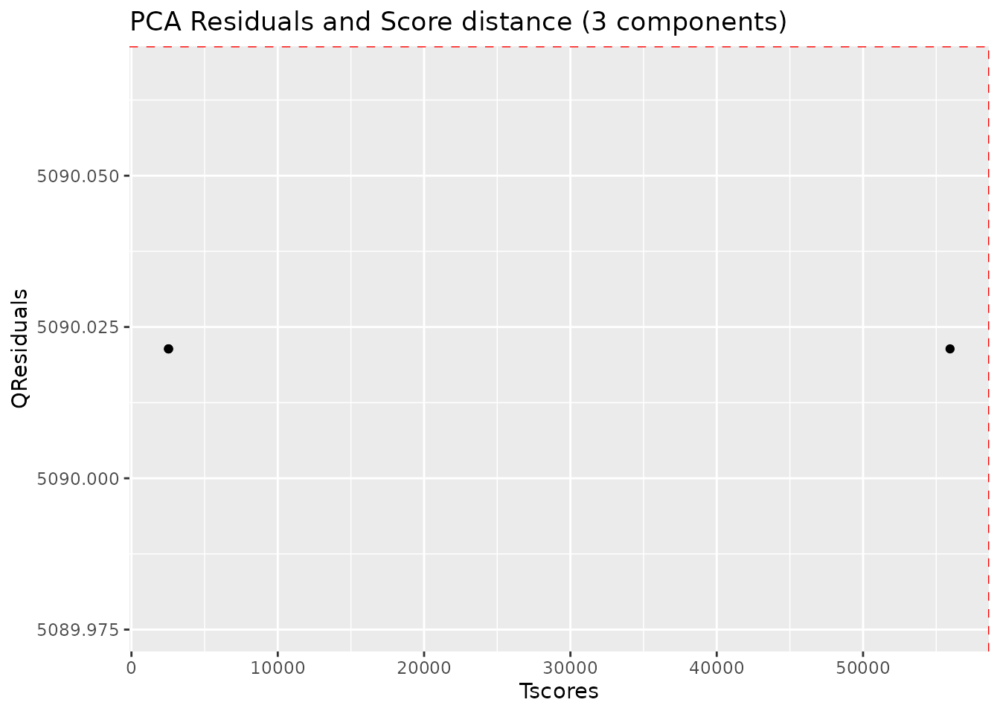
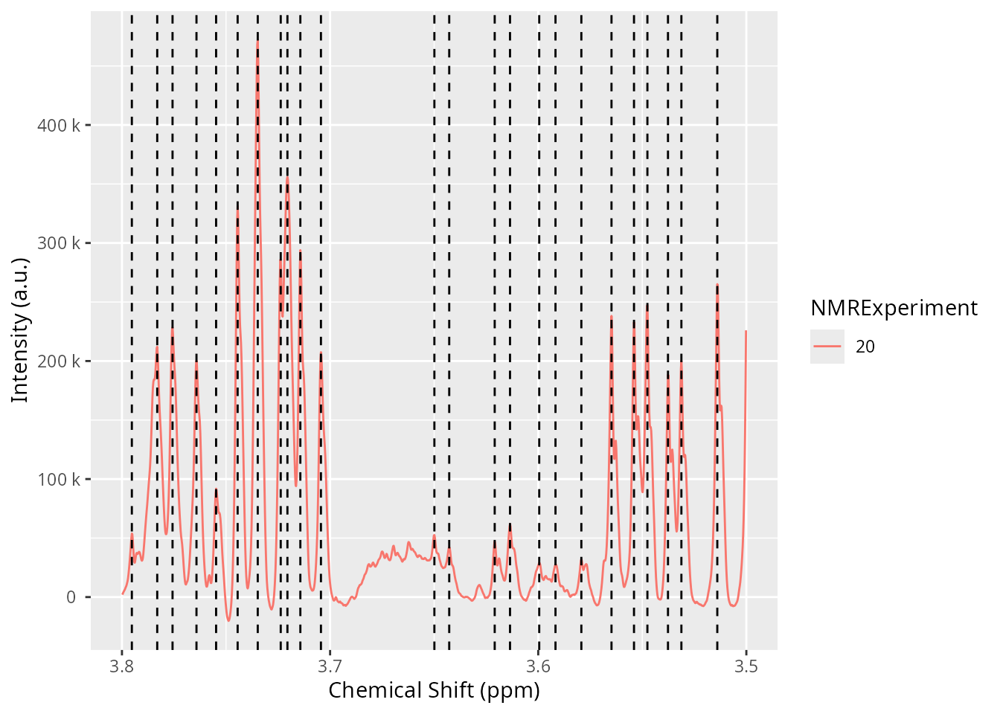
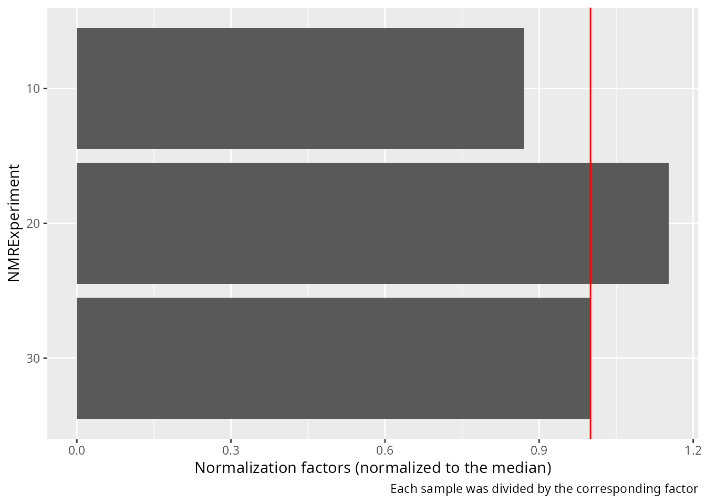
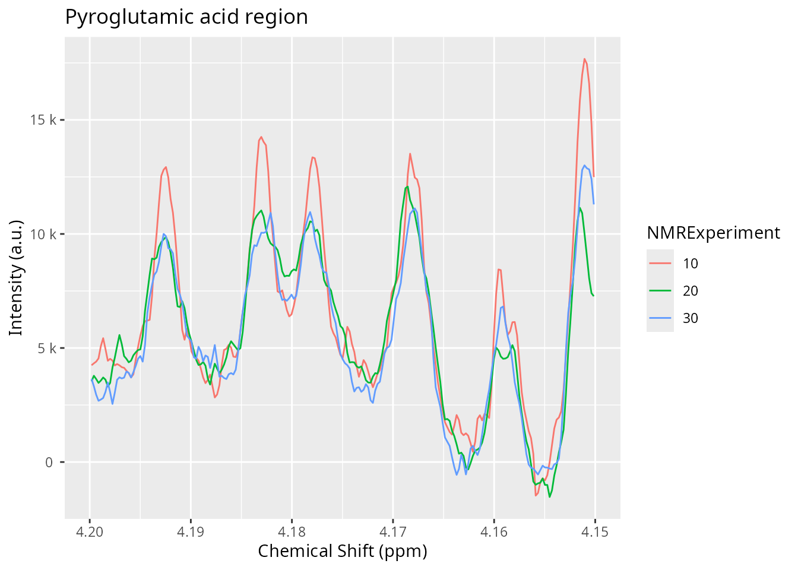
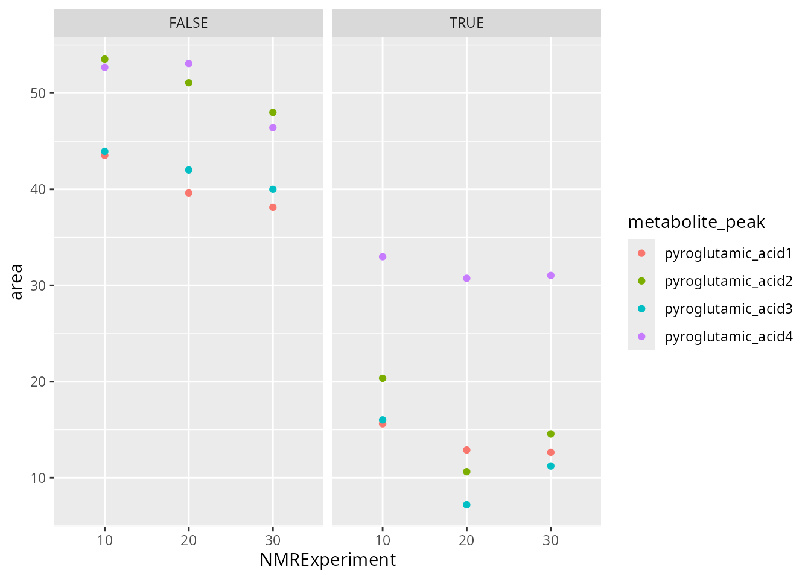

# Introduction to AlpsNMR (older API)

Abstract

An introduction to the AlpsNMR package, showing the most relevant
functions and a proposed workflow, using the older workflow.

The `AlpsNMR` package was written with two purposes in mind:

- to help **data analysts and NMR scientists** to work with NMR samples.
- to help **IT pipeline builders** implement automated methods for
  preprocessing.

Functions from this package written for data analysts and NMR scientists
are prefixed with `nmr_`, while higher level functions written for IT
pipeline builders are prefixed with `pipe_`. The main reason why all
exported functions have a prefix is to make it easy for the user to
discover the functions from the package. By typing nmr\_ RStudio will
return the list of exported functions. In the R terminal, nmr\_ followed
by the tab key (⇥) twice will have the same effect. Other popular
packages, follow similar approaches (e.g: `forcats`: `fct_*`, `stringr`:
`str_*`).

This vignette is written for the first group. It assumes some prior
basic knowledge of NMR and data analysis, as well as some basic R
programming. In case you are interested in building pipelines with this
package, you may want to open the file saved in this directory (run it
on your computer):

    pipeline_example <- system.file("pipeline-rmd", "pipeline_example.R", package = "AlpsNMR")
    pipeline_example

``` r

library(BiocParallel)
library(AlpsNMR)
#> 
#> Attaching package: 'AlpsNMR'
#> The following object is masked from 'package:stats':
#> 
#>     filter
library(ggplot2)
```

## Enable parallellization

This package is able to parallellize several functions through the use
of the `BiocParallel` package. Whether to parallelize or not is left to
the user that can control the parallellization registering backends.
Please check the `BiocParallel` introduction for further details

``` r

library(BiocParallel)
#register(SerialParam(), default = TRUE)  # disable parallellization
register(SnowParam(workers = 2, exportglobals = FALSE), default = TRUE)  # enable parallellization with 2 workers
```

## Data: The `MeOH_plasma_extraction` dataset

To explore the basics of the AlpsNMR package, we have included four NMR
samples acquired in a 600 MHz Bruker instrument bundled with the
package. The samples are pooled quality control plasma samples, that
were extracted with methanol, and therefore only contain small
molecules.

If you have installed this package, you can obtain the directory where
the four samples are with the command

``` r

MeOH_plasma_extraction_dir <- system.file("dataset-demo", package = "AlpsNMR")
MeOH_plasma_extraction_dir
#> [1] "/__w/_temp/Library/AlpsNMR/dataset-demo"
```

The demo directory includes four samples (zipped) and a dummy Excel
metadata file.

``` r

fs::dir_ls(MeOH_plasma_extraction_dir)
#> /__w/_temp/Library/AlpsNMR/dataset-demo/10.zip
#> /__w/_temp/Library/AlpsNMR/dataset-demo/20.zip
#> /__w/_temp/Library/AlpsNMR/dataset-demo/30.zip
#> /__w/_temp/Library/AlpsNMR/dataset-demo/README.txt
#> /__w/_temp/Library/AlpsNMR/dataset-demo/dummy_metadata.xlsx
```

Given the name of the dataset, one may guess that the dataset was used
to check the Methanol extraction in serum samples. The dummy metadata
consists of dummy information, just for the sake of showing how this
package can integrate external metadata. The excel file consists of two
tidy tables, in two sheets.

``` r

MeOH_plasma_extraction_xlsx <- file.path(MeOH_plasma_extraction_dir, "dummy_metadata.xlsx")
exp_subj_id <- readxl::read_excel(MeOH_plasma_extraction_xlsx, sheet = 1)
subj_id_age <- readxl::read_excel(MeOH_plasma_extraction_xlsx, sheet = 2)
exp_subj_id
#> # A tibble: 3 × 3
#>   NMRExperiment SubjectID TimePoint
#>   <chr>         <chr>     <chr>    
#> 1 10            Ana       baseline 
#> 2 20            Ana       3 months 
#> 3 30            Elia      baseline
subj_id_age
#> # A tibble: 2 × 2
#>   SubjectID   Age
#>   <chr>     <dbl>
#> 1 Ana          29
#> 2 Elia          0
```

## Loading samples

The function to read samples is called `nmr_read_samples`. It expects a
character vector with the samples to load that can be paths to
directories of Bruker format samples or paths to JDX files.

Additionally, this function can filter by pulse sequences (e.g. load
only NOESY samples) or loading only metadata.

``` r

zip_files <- fs::dir_ls(MeOH_plasma_extraction_dir, glob = "*.zip")
zip_files
#> /__w/_temp/Library/AlpsNMR/dataset-demo/10.zip
#> /__w/_temp/Library/AlpsNMR/dataset-demo/20.zip
#> /__w/_temp/Library/AlpsNMR/dataset-demo/30.zip
dataset <- nmr_read_samples(sample_names = zip_files)
dataset
#> An nmr_dataset (3 samples)
```

As we have not added any metadata to this dataset, the only column we
see is the `NMRExperiment`:

``` r

nmr_meta_get(dataset, groups = "external")
#> # A tibble: 3 × 1
#>   NMRExperiment
#>   <chr>        
#> 1 10           
#> 2 20           
#> 3 30
```

## Adding metadata

Initally our dataset only has the `NMRExperiment` column:

``` r

nmr_meta_get(dataset, groups = "external")
#> # A tibble: 3 × 1
#>   NMRExperiment
#>   <chr>        
#> 1 10           
#> 2 20           
#> 3 30
```

The `exp_subj_id` table we loaded links the `NMRExperiment` to the
`SubjectID`.

As we already have the `NMRExperiment` column, we can use it as the
merging column (note that both columns have the same column name to
match the metadata such as group class, age, BMI…):

``` r

dataset <- nmr_meta_add(dataset, metadata = exp_subj_id, by = "NMRExperiment")
nmr_meta_get(dataset, groups = "external")
#> # A tibble: 3 × 3
#>   NMRExperiment SubjectID TimePoint
#>   <chr>         <chr>     <chr>    
#> 1 10            Ana       baseline 
#> 2 20            Ana       3 months 
#> 3 30            Elia      baseline
```

If we have info from different files we can match them. For instance,
now we have the `SubjectID` information so we can add the table that
adds the `SubjectID` to the `Age`.

``` r

dataset <- nmr_meta_add(dataset, metadata = subj_id_age, by = "SubjectID")
nmr_meta_get(dataset, groups = "external")
#> # A tibble: 3 × 4
#>   NMRExperiment SubjectID TimePoint   Age
#>   <chr>         <chr>     <chr>     <dbl>
#> 1 10            Ana       baseline     29
#> 2 20            Ana       3 months     29
#> 3 30            Elia      baseline      0
```

Now we have our metadata integrated in the dataset and we can make use
of it in further data analysis steps.

## Interpolation

1D NMR samples can be interpolated together, in order to arrange all the
spectra into a matrix, with one row per sample. The main parameters we
would need is the range of ppm values that we want to interpolate and
the resolution.

We can see the ppm resolution by looking at the ppm axis of one sample:

``` r

ppm_res <- nmr_ppm_resolution(dataset)[[1]]
message("The ppm resolution is: ", format(ppm_res, digits = 2), " ppm")
#> The ppm resolution is: 0.00023 ppm
```

We can interpolate the dataset, obtaining an `nmr_dataset_1D` object:

``` r

dataset <- nmr_interpolate_1D(dataset, axis = c(min = -0.5, max = 10, by = 2.3E-4))
```

This operation changes the class of the object, as now the data is on a
matrix. The dataset is now of class `nmr_dataset_1D`. The `axis` element
is now a numeric vector and the `data_1r` element is a matrix.

## Plotting samples

The `AlpsNMR` package offers the possibility to plot `nmr_dataset_1D`
objects. Plotting many spectra with so many points is quite expensive so
it is possible to include only some regions of the spectra or plot only
some samples.

Use
[`?plot.nmr_dataset_1D`](https://sipss.github.io/AlpsNMR/reference/plot.nmr_dataset_1D.md)
to check the parameters, among them:

- `NMRExperiment`: A character vector with the NMR experiments to plot
- `chemshift_range`: A ppm range to plot only a small region, or to
  reduce the resolution
- `interactive`: To make the plot interactive - `...`: Can be used to
  pass additional parameters such as `color = "SubjectID"` that are
  passed as aesthetics to ggplot.

``` r

plot(dataset, NMRExperiment = c("10", "30"), chemshift_range = c(2.2, 2.8))
```

### Creating interactive plots

The option `interactive = TRUE` described above has some performance
limitations. As high performance workaround, you can make many plots
interactive with the function `plot_interactive`.

This function will use WebGL technologies to create a webpage that, once
opened, allows you to interact with the plot.

Due to technical limitations, these plots need to be opened manually and
can’t be embedded in RMarkdown documents. Therefore, the function saves
the plot in the directory for further exploration. Additionally, some
old web browsers may not be able to display these interactive plots
correctly.

    plt <- plot(dataset, NMRExperiment = c("10", "30"), chemshift_range = c(2.2, 2.8))
    plot_interactive(plt, "plot_region.html")

## Exclude regions

Some regions can easily be excluded from the spectra with
`nmr_exclude_region`. Note that the regions are fully removed and not
zeroed, as using zeros complicates a lot the implementation[^1] and has
little advantages.

``` r

regions_to_exclude <- list(water = c(4.6, 5), methanol = c(3.33, 3.39))
dataset <- nmr_exclude_region(dataset, exclude = regions_to_exclude)
plot(dataset, chemshift_range = c(4.2, 5.5))
```

## Filter samples

Maybe we just want to analyze a subset of the data, e.g., only a class
group or a particular gender. We can filter some samples according to
their metadata as follows:

``` r

samples_10_20 <- filter(dataset, SubjectID == "Ana")
nmr_meta_get(samples_10_20, groups = "external")
#> # A tibble: 2 × 4
#>   NMRExperiment SubjectID TimePoint   Age
#>   <chr>         <chr>     <chr>     <dbl>
#> 1 10            Ana       baseline     29
#> 2 20            Ana       3 months     29
```

## Robust PCA for outlier detection

The AlpsNMR package includes robust PCA analysis for outlier detection.
With such a small demo dataset, it is not practical to use, but check
out the documentation of `nmr_pca_outliers_*` functions.

``` r

pca_outliers_rob <- nmr_pca_outliers_robust(dataset, ncomp = 3)
nmr_pca_outliers_plot(dataset, pca_outliers_rob)
```



## Baseline removal

Spectra may display an unstable baseline, specially when processing
blood/fecal blood/fecal samples. If so, `nmr_baseline_removal` subtract
the baseline by means of Asymmetric Least Squares method.

See before:

``` r

plot(dataset, chemshift_range = c(3.5,3.8))
```

And after:

``` r

dataset = nmr_baseline_removal(dataset, lambda = 6, p = 0.01)
plot(dataset, chemshift_range = c(3.5,3.8))
```

## Peak detection

The peak detection is performed on short spectra segments using a
continuous wavelet transform. See
[`?nmr_detect_peaks`](https://sipss.github.io/AlpsNMR/reference/nmr_detect_peaks.md)
for more information.

Our current approach relies on the use of the baseline threshold
(`baselineThresh`) automatic calculated (see
[`?nmr_baseline_threshold`](https://sipss.github.io/AlpsNMR/reference/nmr_baseline_threshold.md))
and the Signal to Noise Threshold (`SNR.Th`) to discriminate valid peaks
from noise.

The combination of the `baselineThresh` and the `SNR.Th` optimizes the
number of actual peaks from noise.

The advantage of the `SNR.Th` method is that it estimates the noise
level on each spectra region independently, so in practice it can be
used as a dynamic baseline threshold level.

``` r

peak_table <- nmr_detect_peaks(dataset,
                               nDivRange_ppm = 0.1,
                               scales = seq(1, 16, 2),
                               baselineThresh = NULL, SNR.Th = 3)
NMRExp_ref <- nmr_align_find_ref(dataset, peak_table)
message("Your reference is NMRExperiment ", NMRExp_ref)
#> Your reference is NMRExperiment 30
nmr_detect_peaks_plot(dataset, peak_table, NMRExperiment = "20", chemshift_range = c(3.5,3.8))
```



## Spectra alignment

To align the sample, we use the `nmr_align` function, which in turn uses
a hierarchical clustering method (see
[`?nmr_align`](https://sipss.github.io/AlpsNMR/reference/nmr_align.md)
for further details).

The `maxShift_ppm` limits the maximum shift allowed for the spectra.

``` r

nmr_exp_ref <- nmr_align_find_ref(dataset, peak_table)
dataset_align <- nmr_align(dataset, peak_table, nmr_exp_ref, maxShift_ppm = 0.0015, acceptLostPeak = FALSE)
```

``` r

plot(dataset, chemshift_range = c(3.025, 3.063))
plot(dataset_align, chemshift_range = c(3.025, 3.063))
```

## Normalization

There are multiple normalization techniques available. The most strongly
recommended is the `pqn` normalization, but it may not be fully reliable
when the number of samples is small, as it needs a computation of the
median spectra. Nevertheless, it is possible to compute it:

``` r

dataset_norm <- nmr_normalize(dataset_align, method = "pqn")
#> Warning: There are not enough samples for reliably estimating the median spectra
#> ℹ The Probabalistic Quotient Normalization requires several samples to compute the median spectra. Your number of samples is low
#> ℹ Review your peaks before and after normalization to ensure there are no big distortions
```

The `AlpsNMR` package offers the possibility to extract additional
normalization information with `nmr_normalize_extra_info(dataset)`, to
explore the normalization factors applied to each sample:

The plot shows the dispersion with respect to the median of the
normalization factors, and can highlight samples with abnormaly large or
small normalization factors.

``` r

diagnostic <- nmr_normalize_extra_info(dataset_norm)
diagnostic$norm_factor
#>   NMRExperiment norm_factor norm_factor_norm
#> 1            10   0.8706322        0.8706322
#> 2            20   1.1523450        1.1523450
#> 3            30   1.0000000        1.0000000
diagnostic$plot
```



## Peak integration

### 1. Integration based on peak center and width

If we want to integrate the whole spectra, we need ppm from the
`peak_table`. See `Peak detection` section. The function
`nmr_integrate_peak_positions` generates a new `nmr_dataset_1D` object
containing the integrals from the `peak_table` (ppm values corresponding
to detected peaks).

``` r

peak_table_integration = nmr_integrate_peak_positions(
  samples = dataset_norm,
  peak_pos_ppm = peak_table$ppm,
  peak_width_ppm = 0.006)
#> New names:
#> • `ppm_-0.0002` -> `ppm_-0.0002...6`
#> • `ppm_0.8607` -> `ppm_0.8607...22`
#> • `ppm_0.8655` -> `ppm_0.8655...23`
#> • `ppm_0.8729` -> `ppm_0.8729...24`
#> • `ppm_0.8784` -> `ppm_0.8784...25`
#> • `ppm_0.8910` -> `ppm_0.8910...26`
#> • `ppm_0.9032` -> `ppm_0.9032...27`
#> • `ppm_0.9085` -> `ppm_0.9085...28`
#> • `ppm_0.9196` -> `ppm_0.9196...30`
#> • `ppm_0.9313` -> `ppm_0.9313...31`
#> • `ppm_0.9437` -> `ppm_0.9437...32`
#> • `ppm_0.9554` -> `ppm_0.9554...33`
#> • `ppm_0.9658` -> `ppm_0.9658...34`
#> • `ppm_0.9902` -> `ppm_0.9902...36`
#> • `ppm_1.0019` -> `ppm_1.0019...37`
#> • `ppm_1.0093` -> `ppm_1.0093...38`
#> • `ppm_1.0208` -> `ppm_1.0208...39`
#> • `ppm_1.0410` -> `ppm_1.0410...40`
#> • `ppm_1.0716` -> `ppm_1.0716...43`
#> • `ppm_1.0803` -> `ppm_1.0803...44`
#> • `ppm_1.1505` -> `ppm_1.1505...46`
#> • `ppm_1.1979` -> `ppm_1.1979...47`
#> • `ppm_1.2084` -> `ppm_1.2084...48`
#> • `ppm_1.2179` -> `ppm_1.2179...49`
#> • `ppm_1.3262` -> `ppm_1.3262...54`
#> • `ppm_1.3377` -> `ppm_1.3377...55`
#> • `ppm_1.4424` -> `ppm_1.4424...57`
#> • `ppm_1.4913` -> `ppm_1.4913...59`
#> • `ppm_1.5693` -> `ppm_1.5693...66`
#> • `ppm_1.6195` -> `ppm_1.6195...72`
#> • `ppm_1.6443` -> `ppm_1.6443...75`
#> • `ppm_1.6562` -> `ppm_1.6562...77`
#> • `ppm_1.6799` -> `ppm_1.6799...80`
#> • `ppm_1.6990` -> `ppm_1.6990...86`
#> • `ppm_1.7351` -> `ppm_1.7351...92`
#> • `ppm_1.7614` -> `ppm_1.7614...95`
#> • `ppm_1.8131` -> `ppm_1.8131...97`
#> • `ppm_1.8748` -> `ppm_1.8748...103`
#> • `ppm_1.9210` -> `ppm_1.9210...106`
#> • `ppm_1.9313` -> `ppm_1.9313...107`
#> • `ppm_2.0026` -> `ppm_2.0026...114`
#> • `ppm_2.0194` -> `ppm_2.0194...117`
#> • `ppm_2.0307` -> `ppm_2.0307...118`
#> • `ppm_2.0422` -> `ppm_2.0422...119`
#> • `ppm_2.0806` -> `ppm_2.0806...123`
#> • `ppm_2.1149` -> `ppm_2.1149...126`
#> • `ppm_2.1192` -> `ppm_2.1192...127`
#> • `ppm_2.1273` -> `ppm_2.1273...128`
#> • `ppm_2.1324` -> `ppm_2.1324...129`
#> • `ppm_2.1572` -> `ppm_2.1572...134`
#> • `ppm_2.1655` -> `ppm_2.1655...135`
#> • `ppm_2.2835` -> `ppm_2.2835...143`
#> • `ppm_2.2950` -> `ppm_2.2950...144`
#> • `ppm_2.3251` -> `ppm_2.3251...147`
#> • `ppm_2.3451` -> `ppm_2.3451...149`
#> • `ppm_2.3513` -> `ppm_2.3513...150`
#> • `ppm_2.3575` -> `ppm_2.3575...151`
#> • `ppm_2.3644` -> `ppm_2.3644...152`
#> • `ppm_2.3711` -> `ppm_2.3711...153`
#> • `ppm_2.4196` -> `ppm_2.4196...157`
#> • `ppm_2.4912` -> `ppm_2.4912...166`
#> • `ppm_2.4953` -> `ppm_2.4953...167`
#> • `ppm_2.5284` -> `ppm_2.5284...171`
#> • `ppm_2.6216` -> `ppm_2.6216...177`
#> • `ppm_2.7577` -> `ppm_2.7577...188`
#> • `ppm_2.9332` -> `ppm_2.9332...199`
#> • `ppm_3.0305` -> `ppm_3.0305...206`
#> • `ppm_3.0404` -> `ppm_3.0404...207`
#> • `ppm_3.0489` -> `ppm_3.0489...208`
#> • `ppm_3.2081` -> `ppm_3.2081...218`
#> • `ppm_3.2154` -> `ppm_3.2154...219`
#> • `ppm_3.2320` -> `ppm_3.2320...220`
#> • `ppm_3.2382` -> `ppm_3.2382...221`
#> • `ppm_3.2672` -> `ppm_3.2672...223`
#> • `ppm_3.2706` -> `ppm_3.2706...224`
#> • `ppm_3.4031` -> `ppm_3.4031...228`
#> • `ppm_3.4243` -> `ppm_3.4243...231`
#> • `ppm_3.4829` -> `ppm_3.4829...238`
#> • `ppm_3.4981` -> `ppm_3.4981...240`
#> • `ppm_3.5135` -> `ppm_3.5135...241`
#> • `ppm_3.5372` -> `ppm_3.5372...243`
#> • `ppm_3.7042` -> `ppm_3.7042...254`
#> • `ppm_3.7141` -> `ppm_3.7141...255`
#> • `ppm_3.7200` -> `ppm_3.7200...256`
#> • `ppm_3.7237` -> `ppm_3.7237...257`
#> • `ppm_3.7348` -> `ppm_3.7348...258`
#> • `ppm_3.7442` -> `ppm_3.7442...259`
#> • `ppm_3.7757` -> `ppm_3.7757...262`
#> • `ppm_3.8233` -> `ppm_3.8233...265`
#> • `ppm_3.8438` -> `ppm_3.8438...268`
#> • `ppm_3.8528` -> `ppm_3.8528...270`
#> • `ppm_3.8886` -> `ppm_3.8886...273`
#> • `ppm_3.8923` -> `ppm_3.8923...274`
#> • `ppm_3.9091` -> `ppm_3.9091...275`
#> • `ppm_3.9128` -> `ppm_3.9128...276`
#> • `ppm_3.9333` -> `ppm_3.9333...277`
#> • `ppm_3.9493` -> `ppm_3.9493...278`
#> • `ppm_3.9917` -> `ppm_3.9917...282`
#> • `ppm_4.0020` -> `ppm_4.0020...283`
#> • `ppm_4.0108` -> `ppm_4.0108...284`
#> • `ppm_4.1205` -> `ppm_4.1205...288`
#> • `ppm_4.1320` -> `ppm_4.1320...289`
#> • `ppm_4.1927` -> `ppm_4.1927...291`
#> • `ppm_4.2281` -> `ppm_4.2281...293`
#> • `ppm_4.2398` -> `ppm_4.2398...295`
#> • `ppm_4.2566` -> `ppm_4.2566...299`
#> • `ppm_4.4376` -> `ppm_4.4376...315`
#> • `ppm_4.4531` -> `ppm_4.4531...317`
#> • `ppm_4.5218` -> `ppm_4.5218...320`
#> • `ppm_4.5221` -> `ppm_4.5221...321`
#> • `ppm_4.5906` -> `ppm_4.5906...324`
#> • `ppm_4.5991` -> `ppm_4.5991...325`
#> • `ppm_5.2369` -> `ppm_5.2369...329`
#> • `ppm_5.4154` -> `ppm_5.4154...336`
#> • `ppm_6.1026` -> `ppm_6.1026...350`
#> • `ppm_6.9009` -> `ppm_6.9009...361`
#> • `ppm_6.9154` -> `ppm_6.9154...362`
#> • `ppm_7.2894` -> `ppm_7.2894...372`
#> • `ppm_7.3014` -> `ppm_7.3014...373`
#> • `ppm_7.3409` -> `ppm_7.3409...376`
#> • `ppm_7.3816` -> `ppm_7.3816...380`
#> • `ppm_7.4881` -> `ppm_7.4881...387`
#> • `ppm_7.5553` -> `ppm_7.5553...390`
#> • `ppm_8.2458` -> `ppm_8.2458...407`
#> • `ppm_8.3515` -> `ppm_8.3515...409`
#> • `ppm_8.4608` -> `ppm_8.4608...411`
#> • `ppm_-0.0002` -> `ppm_-0.0002...422`
#> • `ppm_0.8110` -> `ppm_0.8110...438`
#> • `ppm_0.8552` -> `ppm_0.8552...442`
#> • `ppm_0.8607` -> `ppm_0.8607...443`
#> • `ppm_0.8784` -> `ppm_0.8784...446`
#> • `ppm_0.8910` -> `ppm_0.8910...447`
#> • `ppm_0.9085` -> `ppm_0.9085...449`
#> • `ppm_0.9196` -> `ppm_0.9196...450`
#> • `ppm_0.9313` -> `ppm_0.9313...451`
#> • `ppm_0.9437` -> `ppm_0.9437...452`
#> • `ppm_0.9554` -> `ppm_0.9554...453`
#> • `ppm_0.9658` -> `ppm_0.9658...454`
#> • `ppm_1.0093` -> `ppm_1.0093...458`
#> • `ppm_1.0205` -> `ppm_1.0205...459`
#> • `ppm_1.0716` -> `ppm_1.0716...463`
#> • `ppm_1.0803` -> `ppm_1.0803...464`
#> • `ppm_1.1505` -> `ppm_1.1505...468`
#> • `ppm_1.2084` -> `ppm_1.2084...470`
#> • `ppm_1.2179` -> `ppm_1.2179...471`
#> • `ppm_1.2294` -> `ppm_1.2294...472`
#> • `ppm_1.3262` -> `ppm_1.3262...476`
#> • `ppm_1.3377` -> `ppm_1.3377...477`
#> • `ppm_1.4308` -> `ppm_1.4308...478`
#> • `ppm_1.4424` -> `ppm_1.4424...479`
#> • `ppm_1.4794` -> `ppm_1.4794...480`
#> • `ppm_1.5693` -> `ppm_1.5693...487`
#> • `ppm_1.6195` -> `ppm_1.6195...491`
#> • `ppm_1.6319` -> `ppm_1.6319...492`
#> • `ppm_1.6441` -> `ppm_1.6441...494`
#> • `ppm_1.6560` -> `ppm_1.6560...495`
#> • `ppm_1.6562` -> `ppm_1.6562...496`
#> • `ppm_1.6675` -> `ppm_1.6675...498`
#> • `ppm_1.6747` -> `ppm_1.6747...499`
#> • `ppm_1.6799` -> `ppm_1.6799...501`
#> • `ppm_1.6990` -> `ppm_1.6990...503`
#> • `ppm_1.7075` -> `ppm_1.7075...504`
#> • `ppm_1.7614` -> `ppm_1.7614...511`
#> • `ppm_1.8752` -> `ppm_1.8752...522`
#> • `ppm_1.9812` -> `ppm_1.9812...530`
#> • `ppm_2.0422` -> `ppm_2.0422...537`
#> • `ppm_2.0923` -> `ppm_2.0923...542`
#> • `ppm_2.1192` -> `ppm_2.1192...545`
#> • `ppm_2.1273` -> `ppm_2.1273...546`
#> • `ppm_2.1324` -> `ppm_2.1324...547`
#> • `ppm_2.1572` -> `ppm_2.1572...550`
#> • `ppm_2.1655` -> `ppm_2.1655...551`
#> • `ppm_2.2515` -> `ppm_2.2515...558`
#> • `ppm_2.2717` -> `ppm_2.2717...561`
#> • `ppm_2.3451` -> `ppm_2.3451...570`
#> • `ppm_2.3513` -> `ppm_2.3513...571`
#> • `ppm_2.3575` -> `ppm_2.3575...572`
#> • `ppm_2.3644` -> `ppm_2.3644...573`
#> • `ppm_2.4063` -> `ppm_2.4063...577`
#> • `ppm_2.4196` -> `ppm_2.4196...578`
#> • `ppm_2.4456` -> `ppm_2.4456...581`
#> • `ppm_2.4953` -> `ppm_2.4953...586`
#> • `ppm_2.5284` -> `ppm_2.5284...590`
#> • `ppm_2.7994` -> `ppm_2.7994...606`
#> • `ppm_2.9339` -> `ppm_2.9339...615`
#> • `ppm_3.2154` -> `ppm_3.2154...638`
#> • `ppm_3.2706` -> `ppm_3.2706...643`
#> • `ppm_3.3930` -> `ppm_3.3930...646`
#> • `ppm_3.4185` -> `ppm_3.4185...648`
#> • `ppm_3.5793` -> `ppm_3.5793...663`
#> • `ppm_3.6428` -> `ppm_3.6428...668`
#> • `ppm_3.6499` -> `ppm_3.6499...669`
#> • `ppm_3.7237` -> `ppm_3.7237...673`
#> • `ppm_3.7348` -> `ppm_3.7348...674`
#> • `ppm_3.7642` -> `ppm_3.7642...677`
#> • `ppm_3.7757` -> `ppm_3.7757...678`
#> • `ppm_3.8438` -> `ppm_3.8438...683`
#> • `ppm_3.8923` -> `ppm_3.8923...689`
#> • `ppm_3.9128` -> `ppm_3.9128...691`
#> • `ppm_3.9917` -> `ppm_3.9917...698`
#> • `ppm_4.0020` -> `ppm_4.0020...699`
#> • `ppm_4.2281` -> `ppm_4.2281...712`
#> • `ppm_4.2398` -> `ppm_4.2398...714`
#> • `ppm_4.2566` -> `ppm_4.2566...717`
#> • `ppm_4.5089` -> `ppm_4.5089...735`
#> • `ppm_4.5092` -> `ppm_4.5092...736`
#> • `ppm_4.5221` -> `ppm_4.5221...737`
#> • `ppm_4.5991` -> `ppm_4.5991...742`
#> • `ppm_5.0973` -> `ppm_5.0973...744`
#> • `ppm_5.4154` -> `ppm_5.4154...753`
#> • `ppm_5.4220` -> `ppm_5.4220...754`
#> • `ppm_6.1026` -> `ppm_6.1026...771`
#> • `ppm_6.9154` -> `ppm_6.9154...790`
#> • `ppm_6.9626` -> `ppm_6.9626...791`
#> • `ppm_7.2066` -> `ppm_7.2066...798`
#> • `ppm_7.3014` -> `ppm_7.3014...803`
#> • `ppm_7.3409` -> `ppm_7.3409...806`
#> • `ppm_7.4881` -> `ppm_7.4881...816`
#> • `ppm_7.5415` -> `ppm_7.5415...819`
#> • `ppm_8.2458` -> `ppm_8.2458...839`
#> • `ppm_8.4608` -> `ppm_8.4608...842`
#> • `ppm_-0.0002` -> `ppm_-0.0002...853`
#> • `ppm_0.8110` -> `ppm_0.8110...865`
#> • `ppm_0.8552` -> `ppm_0.8552...869`
#> • `ppm_0.8655` -> `ppm_0.8655...871`
#> • `ppm_0.8729` -> `ppm_0.8729...872`
#> • `ppm_0.9032` -> `ppm_0.9032...875`
#> • `ppm_0.9085` -> `ppm_0.9085...876`
#> • `ppm_0.9196` -> `ppm_0.9196...877`
#> • `ppm_0.9313` -> `ppm_0.9313...878`
#> • `ppm_0.9902` -> `ppm_0.9902...883`
#> • `ppm_1.0019` -> `ppm_1.0019...884`
#> • `ppm_1.0205` -> `ppm_1.0205...886`
#> • `ppm_1.0208` -> `ppm_1.0208...887`
#> • `ppm_1.0410` -> `ppm_1.0410...888`
#> • `ppm_1.0716` -> `ppm_1.0716...891`
#> • `ppm_1.0803` -> `ppm_1.0803...892`
#> • `ppm_1.1505` -> `ppm_1.1505...896`
#> • `ppm_1.1979` -> `ppm_1.1979...897`
#> • `ppm_1.2084` -> `ppm_1.2084...898`
#> • `ppm_1.2179` -> `ppm_1.2179...899`
#> • `ppm_1.2294` -> `ppm_1.2294...900`
#> • `ppm_1.3262` -> `ppm_1.3262...904`
#> • `ppm_1.3377` -> `ppm_1.3377...905`
#> • `ppm_1.4308` -> `ppm_1.4308...906`
#> • `ppm_1.4424` -> `ppm_1.4424...907`
#> • `ppm_1.4794` -> `ppm_1.4794...908`
#> • `ppm_1.4913` -> `ppm_1.4913...909`
#> • `ppm_1.6319` -> `ppm_1.6319...919`
#> • `ppm_1.6441` -> `ppm_1.6441...920`
#> • `ppm_1.6443` -> `ppm_1.6443...921`
#> • `ppm_1.6560` -> `ppm_1.6560...922`
#> • `ppm_1.6562` -> `ppm_1.6562...923`
#> • `ppm_1.6675` -> `ppm_1.6675...924`
#> • `ppm_1.6747` -> `ppm_1.6747...925`
#> • `ppm_1.6799` -> `ppm_1.6799...927`
#> • `ppm_1.6990` -> `ppm_1.6990...930`
#> • `ppm_1.7075` -> `ppm_1.7075...933`
#> • `ppm_1.7351` -> `ppm_1.7351...937`
#> • `ppm_1.7614` -> `ppm_1.7614...940`
#> • `ppm_1.8131` -> `ppm_1.8131...945`
#> • `ppm_1.8748` -> `ppm_1.8748...952`
#> • `ppm_1.8752` -> `ppm_1.8752...953`
#> • `ppm_1.9210` -> `ppm_1.9210...956`
#> • `ppm_1.9313` -> `ppm_1.9313...957`
#> • `ppm_1.9812` -> `ppm_1.9812...962`
#> • `ppm_2.0026` -> `ppm_2.0026...964`
#> • `ppm_2.0194` -> `ppm_2.0194...967`
#> • `ppm_2.0307` -> `ppm_2.0307...968`
#> • `ppm_2.0806` -> `ppm_2.0806...974`
#> • `ppm_2.0923` -> `ppm_2.0923...975`
#> • `ppm_2.1149` -> `ppm_2.1149...977`
#> • `ppm_2.1192` -> `ppm_2.1192...978`
#> • `ppm_2.1273` -> `ppm_2.1273...979`
#> • `ppm_2.2515` -> `ppm_2.2515...992`
#> • `ppm_2.2717` -> `ppm_2.2717...995`
#> • `ppm_2.2835` -> `ppm_2.2835...997`
#> • `ppm_2.2950` -> `ppm_2.2950...999`
#> • `ppm_2.3251` -> `ppm_2.3251...1002`
#> • `ppm_2.3513` -> `ppm_2.3513...1005`
#> • `ppm_2.3575` -> `ppm_2.3575...1006`
#> • `ppm_2.3711` -> `ppm_2.3711...1008`
#> • `ppm_2.4063` -> `ppm_2.4063...1011`
#> • `ppm_2.4196` -> `ppm_2.4196...1012`
#> • `ppm_2.4456` -> `ppm_2.4456...1015`
#> • `ppm_2.4912` -> `ppm_2.4912...1020`
#> • `ppm_2.6216` -> `ppm_2.6216...1029`
#> • `ppm_2.7577` -> `ppm_2.7577...1039`
#> • `ppm_2.7994` -> `ppm_2.7994...1041`
#> • `ppm_2.9332` -> `ppm_2.9332...1050`
#> • `ppm_2.9339` -> `ppm_2.9339...1051`
#> • `ppm_3.0305` -> `ppm_3.0305...1058`
#> • `ppm_3.0404` -> `ppm_3.0404...1059`
#> • `ppm_3.0489` -> `ppm_3.0489...1060`
#> • `ppm_3.2081` -> `ppm_3.2081...1070`
#> • `ppm_3.2320` -> `ppm_3.2320...1072`
#> • `ppm_3.2382` -> `ppm_3.2382...1073`
#> • `ppm_3.2672` -> `ppm_3.2672...1075`
#> • `ppm_3.3930` -> `ppm_3.3930...1079`
#> • `ppm_3.4031` -> `ppm_3.4031...1080`
#> • `ppm_3.4185` -> `ppm_3.4185...1082`
#> • `ppm_3.4243` -> `ppm_3.4243...1083`
#> • `ppm_3.4829` -> `ppm_3.4829...1090`
#> • `ppm_3.4981` -> `ppm_3.4981...1092`
#> • `ppm_3.5135` -> `ppm_3.5135...1093`
#> • `ppm_3.5372` -> `ppm_3.5372...1095`
#> • `ppm_3.5793` -> `ppm_3.5793...1099`
#> • `ppm_3.6428` -> `ppm_3.6428...1104`
#> • `ppm_3.6499` -> `ppm_3.6499...1105`
#> • `ppm_3.7042` -> `ppm_3.7042...1106`
#> • `ppm_3.7141` -> `ppm_3.7141...1107`
#> • `ppm_3.7200` -> `ppm_3.7200...1108`
#> • `ppm_3.7348` -> `ppm_3.7348...1110`
#> • `ppm_3.7442` -> `ppm_3.7442...1111`
#> • `ppm_3.7642` -> `ppm_3.7642...1113`
#> • `ppm_3.8233` -> `ppm_3.8233...1117`
#> • `ppm_3.8528` -> `ppm_3.8528...1121`
#> • `ppm_3.8886` -> `ppm_3.8886...1124`
#> • `ppm_3.9091` -> `ppm_3.9091...1126`
#> • `ppm_3.9333` -> `ppm_3.9333...1128`
#> • `ppm_3.9493` -> `ppm_3.9493...1129`
#> • `ppm_4.0108` -> `ppm_4.0108...1136`
#> • `ppm_4.1205` -> `ppm_4.1205...1141`
#> • `ppm_4.1320` -> `ppm_4.1320...1142`
#> • `ppm_4.1927` -> `ppm_4.1927...1145`
#> • `ppm_4.2281` -> `ppm_4.2281...1148`
#> • `ppm_4.2566` -> `ppm_4.2566...1154`
#> • `ppm_4.4376` -> `ppm_4.4376...1166`
#> • `ppm_4.4531` -> `ppm_4.4531...1168`
#> • `ppm_4.5089` -> `ppm_4.5089...1171`
#> • `ppm_4.5092` -> `ppm_4.5092...1172`
#> • `ppm_4.5218` -> `ppm_4.5218...1173`
#> • `ppm_4.5906` -> `ppm_4.5906...1178`
#> • `ppm_5.0973` -> `ppm_5.0973...1184`
#> • `ppm_5.2369` -> `ppm_5.2369...1187`
#> • `ppm_5.4220` -> `ppm_5.4220...1195`
#> • `ppm_6.9009` -> `ppm_6.9009...1225`
#> • `ppm_6.9154` -> `ppm_6.9154...1226`
#> • `ppm_6.9626` -> `ppm_6.9626...1227`
#> • `ppm_7.2066` -> `ppm_7.2066...1234`
#> • `ppm_7.2894` -> `ppm_7.2894...1237`
#> • `ppm_7.3409` -> `ppm_7.3409...1241`
#> • `ppm_7.3816` -> `ppm_7.3816...1243`
#> • `ppm_7.5415` -> `ppm_7.5415...1250`
#> • `ppm_7.5553` -> `ppm_7.5553...1251`
#> • `ppm_8.3515` -> `ppm_8.3515...1273`
#> • `ppm_8.4608` -> `ppm_8.4608...1274`

peak_table_integration = get_integration_with_metadata(peak_table_integration)
```

We can also integrate with a specific peak position and some arbitrary
width:

``` r

nmr_data(
  nmr_integrate_peak_positions(samples = dataset_norm,
                            peak_pos_ppm = c(4.1925, 4.183, 4.1775, 4.17),
                            peak_width_ppm = 0.006)
)
#>    ppm_4.1925 ppm_4.1830 ppm_4.1775 ppm_4.1700
#> 10   47.88901   53.53241   50.49386   45.62978
#> 20   44.18572   51.07377   49.52798   44.53178
#> 30   42.39196   47.99196   46.34812   39.07835
```

### 2. Integration based on peak boundaries

Imagine we only want to integrate the four peaks corresponding to the
pyroglutamic acid:

``` r

pyroglutamic_acid_region <- c(4.15, 4.20)
plot(dataset_norm, chemshift_range = pyroglutamic_acid_region) +
  ggplot2::ggtitle("Pyroglutamic acid region")
```



We define the peak regions and integrate them. Note how we can correct
the baseline or not. If we correct the baseline, the limits of the
integration will be connected with a straight line and that line will be
used as the baseline, that will be subtracted.

``` r

pyroglutamic_acid <- list(pyroglutamic_acid1 = c(4.19, 4.195),
                          pyroglutamic_acid2 = c(4.18, 4.186),
                          pyroglutamic_acid3 = c(4.175, 4.18),
                          pyroglutamic_acid4 = c(4.165, 4.172))
regions_basel_corr_ds <- nmr_integrate_regions(dataset_norm, pyroglutamic_acid, fix_baseline = TRUE)
regions_basel_corr_matrix <- nmr_data(regions_basel_corr_ds)
regions_basel_corr_matrix
#>    pyroglutamic_acid1 pyroglutamic_acid2 pyroglutamic_acid3 pyroglutamic_acid4
#> 10           15.61810           20.36002          16.018972           32.99148
#> 20           12.89344           10.63232           7.196728           30.74094
#> 30           12.65231           14.56388          11.226573           31.03655


regions_basel_not_corr_ds <- nmr_integrate_regions(dataset_norm, pyroglutamic_acid, fix_baseline = FALSE)
regions_basel_not_corr_matrix <- nmr_data(regions_basel_not_corr_ds)
regions_basel_not_corr_matrix
#>    pyroglutamic_acid1 pyroglutamic_acid2 pyroglutamic_acid3 pyroglutamic_acid4
#> 10           43.51763           53.53241           43.93533           52.67311
#> 20           39.61702           51.07377           42.00336           53.07528
#> 30           38.10972           47.99196           39.99623           46.40013
```

We may plot the integral values to explore variation based on the
baseline subtraction.

``` r

dplyr::bind_rows(
  regions_basel_corr_matrix %>%
    as.data.frame() %>%
    tibble::rownames_to_column("NMRExperiment") %>%
    tidyr::gather("metabolite_peak", "area", -NMRExperiment) %>%
    dplyr::mutate(BaselineCorrected = TRUE),
  regions_basel_not_corr_matrix %>%
    as.data.frame() %>%
    tibble::rownames_to_column("NMRExperiment") %>%
    tidyr::gather("metabolite_peak", "area", -NMRExperiment) %>%
    dplyr::mutate(BaselineCorrected = FALSE)
) %>% ggplot() + geom_point(aes(x = NMRExperiment, y = area, color = metabolite_peak)) +
  facet_wrap(~BaselineCorrected)
```



## Identification

After applying any feature selection or machine learning, Alps allows
the identification of features of interest through
`nmr_identify_regions_blood`. The function gives 3 possibilities sorted
by the most probable metabolite (see `nmr_identify_regions_blood` for
details).

``` r

ppm_to_assign <- c(4.060960203, 3.048970634,2.405935596,0.990616851,0.986520147, 1.044258467)
identification <- nmr_identify_regions_blood (ppm_to_assign)
identification[!is.na(identification$Metabolite), ]
#>                     Metabolite HMDB_code Shift_ppm Type  J_Hz Height
#> 1781                  L-Valine HMDB00883     0.991    d  7.01 1.0000
#> 1031 L-Alpha-aminobutyric acid HMDB00452     0.997    t  7.58 1.0000
#> 178                   L-Valine HMDB00883     0.991    d  7.01 1.0000
#> 103  L-Alpha-aminobutyric acid HMDB00452     0.997    t  7.58 1.0000
#> 179                   L-Valine HMDB00883     1.044    d  7.05 0.9614
#> 195          Pyroglutamic acid HMDB00267     2.405    m       0.7466
#> 201              Succinic acid HMDB00254     2.405    s       1.0000
#> 148                   L-Lysine HMDB00182     3.035    t       1.0000
#> 47                  Creatinine HMDB00562     3.045    s       1.0000
#> 44                    Creatine HMDB00064     3.035    s       1.0000
#> 46                  Creatinine HMDB00562     4.065    s       0.4374
#> 182                Myoinositol HMDB00211     4.068    t 2.839     NA
#> 40                     Choline HMDB00097     4.071  ddd       0.0607
#>      Blood_concentration n_reported_in_Blood ppm_to_assign
#> 1781           179.04615                  13     0.9865201
#> 1031            22.80000                   6     0.9865201
#> 178            179.04615                  13     0.9906169
#> 103             22.80000                   6     0.9906169
#> 179            179.04615                  13     1.0442585
#> 195             19.50000                   2     2.4059356
#> 201             16.10000                   8     2.4059356
#> 148            168.20000                  14     3.0489706
#> 47              51.25167                  14     3.0489706
#> 44              48.47000                   6     3.0489706
#> 46              51.25167                  14     4.0609602
#> 182             23.52500                   5     4.0609602
#> 40              13.08000                   5     4.0609602
```

## Final thoughts

This vignette shows many of the features of the package, some features
have room for improvement, others are not fully described, and the
reader will need to browse the documentation. Hopefully it is a good
starting point for using the package.

``` r

sessionInfo()
#> R version 4.6.1 (2026-06-24)
#> Platform: x86_64-pc-linux-gnu
#> Running under: Ubuntu 24.04.4 LTS
#> 
#> Matrix products: default
#> BLAS:   /usr/lib/x86_64-linux-gnu/openblas-pthread/libblas.so.3 
#> LAPACK: /usr/lib/x86_64-linux-gnu/openblas-pthread/libopenblasp-r0.3.26.so;  LAPACK version 3.12.0
#> 
#> locale:
#>  [1] LC_CTYPE=en_US.UTF-8       LC_NUMERIC=C              
#>  [3] LC_TIME=en_US.UTF-8        LC_COLLATE=en_US.UTF-8    
#>  [5] LC_MONETARY=en_US.UTF-8    LC_MESSAGES=en_US.UTF-8   
#>  [7] LC_PAPER=en_US.UTF-8       LC_NAME=C                 
#>  [9] LC_ADDRESS=C               LC_TELEPHONE=C            
#> [11] LC_MEASUREMENT=en_US.UTF-8 LC_IDENTIFICATION=C       
#> 
#> time zone: UTC
#> tzcode source: system (glibc)
#> 
#> attached base packages:
#> [1] stats     graphics  grDevices utils     datasets  methods   base     
#> 
#> other attached packages:
#> [1] ggplot2_4.0.3       AlpsNMR_4.15.0      BiocParallel_1.46.0
#> [4] BiocStyle_2.41.0   
#> 
#> loaded via a namespace (and not attached):
#>   [1] tidyselect_1.2.1       dplyr_1.2.1            farver_2.1.2          
#>   [4] S7_0.2.2               fastmap_1.2.0          MassSpecWavelet_1.78.2
#>   [7] digest_0.6.39          lifecycle_1.0.5        cluster_2.1.8.2       
#>  [10] magrittr_2.0.5         compiler_4.6.1         rngtools_1.5.2        
#>  [13] doSNOW_1.0.20          rlang_1.3.0            sass_0.4.10           
#>  [16] tools_4.6.1            igraph_2.3.3           utf8_1.2.6            
#>  [19] yaml_2.3.12            data.table_1.18.4      knitr_1.51            
#>  [22] doRNG_1.8.6.3          labeling_0.4.3         rARPACK_0.11-0        
#>  [25] htmlwidgets_1.6.4      xml2_1.6.0             plyr_1.8.9            
#>  [28] RColorBrewer_1.1-3     withr_3.0.3            purrr_1.2.2           
#>  [31] itertools_0.1-3        desc_1.4.3             grid_4.6.1            
#>  [34] pcaPP_2.0-5            progressr_1.0.0        iterators_1.0.14      
#>  [37] scales_1.4.0           MASS_7.3-65            signal_1.8-1          
#>  [40] cli_3.6.6              mvtnorm_1.4-2          ellipse_0.5.0         
#>  [43] rmarkdown_2.31         crayon_1.5.3           ragg_1.5.2            
#>  [46] generics_0.1.4         otel_0.2.0             RcppParallel_5.1.11-2 
#>  [49] RSpectra_0.16-2        httr_1.4.8             reshape2_1.4.5        
#>  [52] readxl_1.5.0           cachem_1.1.0           stringr_1.6.0         
#>  [55] rvest_1.0.5            parallel_4.6.1         impute_1.86.0         
#>  [58] BiocManager_1.30.27    cellranger_1.1.0       matrixStats_1.5.0     
#>  [61] vctrs_0.7.3            Matrix_1.7-5           jsonlite_2.0.0        
#>  [64] speaq_2.7.0            SparseM_1.84-2         bookdown_0.47         
#>  [67] ggrepel_0.9.8          baseline_1.3-7         systemfonts_1.3.2     
#>  [70] foreach_1.5.2          tidyr_1.3.2            jquerylib_0.1.4       
#>  [73] snow_0.4-4             missForest_1.6.1       glue_1.8.1            
#>  [76] pkgdown_2.2.1          codetools_0.2-20       mixOmics_6.36.0       
#>  [79] stringi_1.8.7          gtable_0.3.6           tibble_3.3.1          
#>  [82] pillar_1.11.1          htmltools_0.5.9        randomForest_4.7-1.2  
#>  [85] R6_2.6.1               Rdpack_2.6.6           zigg_0.0.2            
#>  [88] textshaping_1.0.5      evaluate_1.0.5         lattice_0.22-9        
#>  [91] rbibutils_2.4.1        Rfast_2.1.5.2          corpcor_1.6.10        
#>  [94] bslib_0.11.0           Rcpp_1.1.2             gridExtra_2.3.1       
#>  [97] ranger_0.18.0          xfun_0.60              fs_2.1.0              
#> [100] pkgconfig_2.0.3
```

[^1]: e.g. it can inadvertedly distort the PQN normalization results
