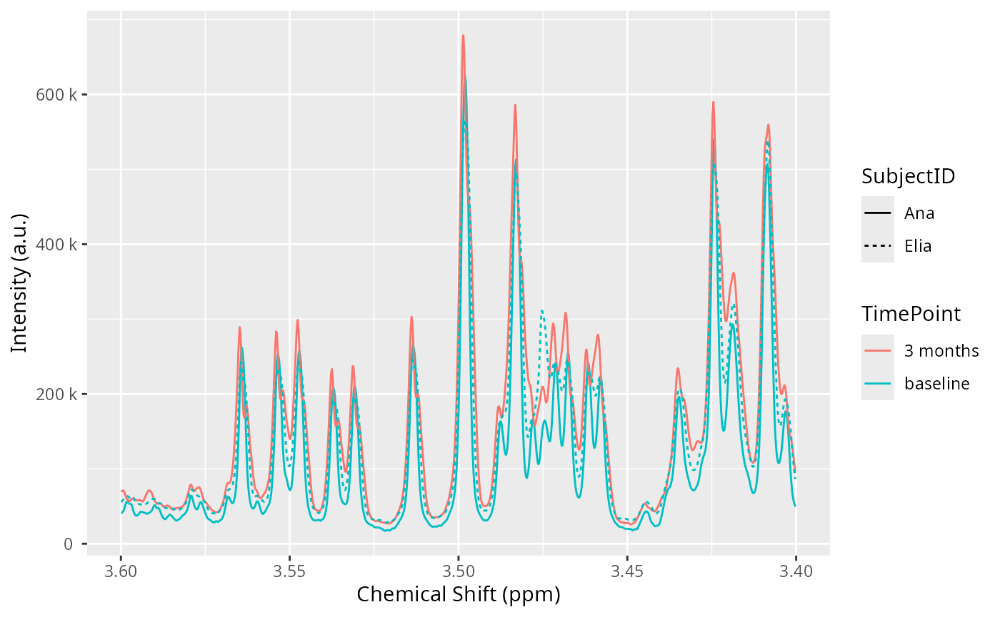
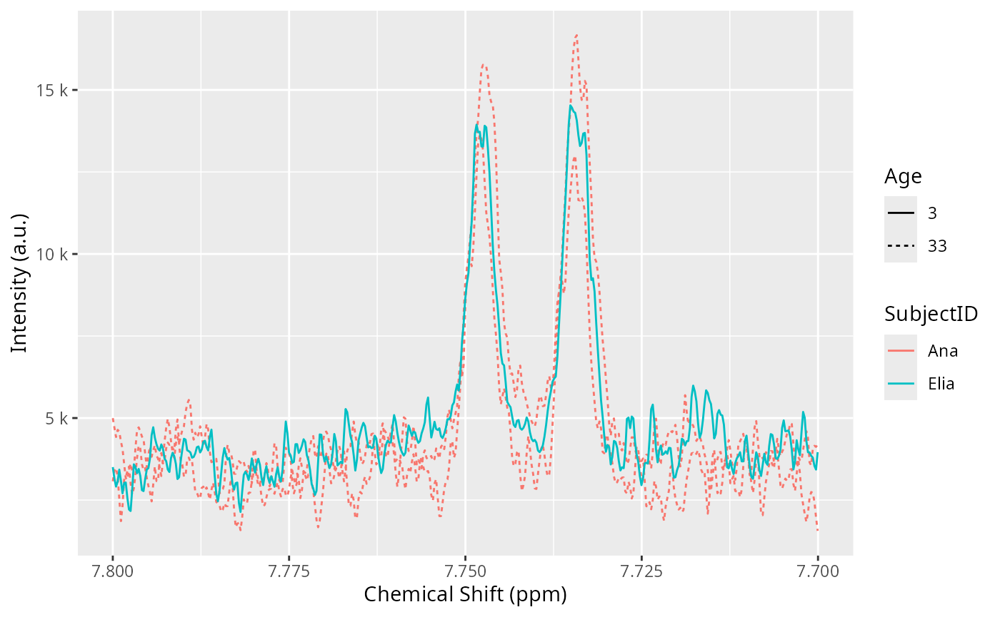

# Handling metadata and annotations

Abstract

This vignette shows some examples on how to explore sample metadata and
add additional sample annotations, coming from one or more CSV or Excel
files.

## Getting started

We start by loading `AlpsNMR` and some convenience libraries:

``` r

library(dplyr)
library(readxl)
library(AlpsNMR)
```

We also load the demo samples, see the introduction vignette for further
details:

``` r

MeOH_plasma_extraction_dir <- system.file("dataset-demo", package = "AlpsNMR")
zip_files <- list.files(MeOH_plasma_extraction_dir, pattern = glob2rx("*.zip"), full.names = TRUE)
dataset <- nmr_read_samples(sample_names = zip_files)
dataset <- nmr_interpolate_1D(dataset, axis = NULL)
dataset
```

    ## An nmr_dataset_1D (3 samples)

``` r

plot(dataset, chemshift_range = c(3.4, 3.6))
```

## Exploring the sample metadata

Most NMR formats include besides the actual NMR spectra, a lot of
additional information describing the acquisition properties, instrument
settings, and spectral processing information.

`AlpsNMR` parses all that information whenever possible, and stores it
in the `nmr_dataset`object, so the user can inspect it. Since there may
be a lot of information, the data is stored in several data frames.

The available data frames are:

``` r

nmr_meta_groups(dataset)
```

    ## [1] "info"     "orig"     "title"    "acqus"    "procs"    "levels"   "external"

We can further explore each of those groups.

For instance, for the `acqus` group we find 239 columns:

``` r

acqus_metadata <- nmr_meta_get(dataset, groups = "acqus")
acqus_metadata
```

    ## # A tibble: 3 × 239
    ##   NMRExperiment acqus_TITLE           acqus_JCAMPDX acqus_DATATYPE acqus_NPOINTS
    ##   <chr>         <chr>                         <dbl> <chr>          <chr>        
    ## 1 10            Parameter file, TopS…             5 Parameter Val… "13\t$$ modi…
    ## 2 20            Parameter file, TopS…             5 Parameter Val… "15\t$$ modi…
    ## 3 30            Parameter file, TopS…             5 Parameter Val… "13\t$$ modi…
    ## # ℹ 234 more variables: acqus_ORIGIN <chr>, acqus_OWNER <chr>,
    ## #   acqus_Stamp <list>, acqus_ACQT0 <dbl>, acqus_AMP <list>,
    ## #   acqus_AMPCOIL <list>, acqus_ANAVPT <dbl>, acqus_AQSEQ <dbl>,
    ## #   acqus_AQ_mod <dbl>, acqus_AUNM <chr>, acqus_AUTOPOS <chr>, acqus_BF1 <dbl>,
    ## #   acqus_BF2 <dbl>, acqus_BF3 <dbl>, acqus_BF4 <dbl>, acqus_BF5 <dbl>,
    ## #   acqus_BF6 <dbl>, acqus_BF7 <dbl>, acqus_BF8 <dbl>, acqus_BWFAC <list>,
    ## #   acqus_BYTORDA <dbl>, acqus_CAGPARS <list>, acqus_CHEMSTR <chr>, …

Here follows a long list of all the columns available:

``` r

colnames(acqus_metadata)
```

    ##   [1] "NMRExperiment"      "acqus_TITLE"        "acqus_JCAMPDX"     
    ##   [4] "acqus_DATATYPE"     "acqus_NPOINTS"      "acqus_ORIGIN"      
    ##   [7] "acqus_OWNER"        "acqus_Stamp"        "acqus_ACQT0"       
    ##  [10] "acqus_AMP"          "acqus_AMPCOIL"      "acqus_ANAVPT"      
    ##  [13] "acqus_AQSEQ"        "acqus_AQ_mod"       "acqus_AUNM"        
    ##  [16] "acqus_AUTOPOS"      "acqus_BF1"          "acqus_BF2"         
    ##  [19] "acqus_BF3"          "acqus_BF4"          "acqus_BF5"         
    ##  [22] "acqus_BF6"          "acqus_BF7"          "acqus_BF8"         
    ##  [25] "acqus_BWFAC"        "acqus_BYTORDA"      "acqus_CAGPARS"     
    ##  [28] "acqus_CHEMSTR"      "acqus_CNST"         "acqus_CPDPRG"      
    ##  [31] "acqus_D"            "acqus_DATE"         "acqus_DE"          
    ##  [34] "acqus_DECBNUC"      "acqus_DECIM"        "acqus_DECNUC"      
    ##  [37] "acqus_DECSTAT"      "acqus_DIGMOD"       "acqus_DIGTYP"      
    ##  [40] "acqus_DQDMODE"      "acqus_DR"           "acqus_DS"          
    ##  [43] "acqus_DSPFIRM"      "acqus_DSPFVS"       "acqus_DTYPA"       
    ##  [46] "acqus_EXP"          "acqus_FCUCHAN"      "acqus_FL1"         
    ##  [49] "acqus_FL2"          "acqus_FL3"          "acqus_FL4"         
    ##  [52] "acqus_FN_INDIRECT"  "acqus_FOV"          "acqus_FQ1LIST"     
    ##  [55] "acqus_FQ2LIST"      "acqus_FQ3LIST"      "acqus_FQ4LIST"     
    ##  [58] "acqus_FQ5LIST"      "acqus_FQ6LIST"      "acqus_FQ7LIST"     
    ##  [61] "acqus_FQ8LIST"      "acqus_FRQLO3"       "acqus_FRQLO3N"     
    ##  [64] "acqus_FS"           "acqus_FTLPGN"       "acqus_FW"          
    ##  [67] "acqus_FnILOOP"      "acqus_FnMODE"       "acqus_FnTYPE"      
    ##  [70] "acqus_GPNAM"        "acqus_GPX"          "acqus_GPY"         
    ##  [73] "acqus_GPZ"          "acqus_GRDPROG"      "acqus_GRPDLY"      
    ##  [76] "acqus_HDDUTY"       "acqus_HDRATE"       "acqus_HGAIN"       
    ##  [79] "acqus_HL1"          "acqus_HL2"          "acqus_HL3"         
    ##  [82] "acqus_HL4"          "acqus_HOLDER"       "acqus_HPMOD"       
    ##  [85] "acqus_HPPRGN"       "acqus_IN"           "acqus_INF"         
    ##  [88] "acqus_INP"          "acqus_INSTRUM"      "acqus_INTEGFAC"    
    ##  [91] "acqus_L"            "acqus_LFILTER"      "acqus_LGAIN"       
    ##  [94] "acqus_LINPSTP"      "acqus_LOCKED"       "acqus_LOCKFLD"     
    ##  [97] "acqus_LOCKGN"       "acqus_LOCKPOW"      "acqus_LOCKPPM"     
    ## [100] "acqus_LOCNUC"       "acqus_LOCPHAS"      "acqus_LOCSHFT"     
    ## [103] "acqus_LOCSW"        "acqus_LTIME"        "acqus_MASR"        
    ## [106] "acqus_MASRLST"      "acqus_MULEXPNO"     "acqus_NBL"         
    ## [109] "acqus_NC"           "acqus_NLOGCH"       "acqus_NOVFLW"      
    ## [112] "acqus_NS"           "acqus_NUC1"         "acqus_NUC2"        
    ## [115] "acqus_NUC3"         "acqus_NUC4"         "acqus_NUC5"        
    ## [118] "acqus_NUC6"         "acqus_NUC7"         "acqus_NUC8"        
    ## [121] "acqus_NUCLEUS"      "acqus_NUSLIST"      "acqus_NusAMOUNT"   
    ## [124] "acqus_NusFPNZ"      "acqus_NusJSP"       "acqus_NusSEED"     
    ## [127] "acqus_NusSPTYPE"    "acqus_NusT2"        "acqus_NusTD"       
    ## [130] "acqus_O1"           "acqus_O2"           "acqus_O3"          
    ## [133] "acqus_O4"           "acqus_O5"           "acqus_O6"          
    ## [136] "acqus_O7"           "acqus_O8"           "acqus_OVERFLW"     
    ## [139] "acqus_P"            "acqus_PACOIL"       "acqus_PAPS"        
    ## [142] "acqus_PARMODE"      "acqus_PCPD"         "acqus_PEXSEL"      
    ## [145] "acqus_PHCOR"        "acqus_PHLIST"       "acqus_PHP"         
    ## [148] "acqus_PH_ref"       "acqus_PL"           "acqus_PLSTEP"      
    ## [151] "acqus_PLSTRT"       "acqus_PLW"          "acqus_PLWMAX"      
    ## [154] "acqus_PQPHASE"      "acqus_PQSCALE"      "acqus_PR"          
    ## [157] "acqus_PRECHAN"      "acqus_PRGAIN"       "acqus_PROBHD"      
    ## [160] "acqus_PULPROG"      "acqus_PW"           "acqus_PYNM"        
    ## [163] "acqus_ProjAngle"    "acqus_QNP"          "acqus_RD"          
    ## [166] "acqus_RECCHAN"      "acqus_RECPH"        "acqus_RECPRE"      
    ## [169] "acqus_RECPRFX"      "acqus_RECSEL"       "acqus_RG"          
    ## [172] "acqus_RO"           "acqus_RSEL"         "acqus_S"           
    ## [175] "acqus_SELREC"       "acqus_SFO1"         "acqus_SFO2"        
    ## [178] "acqus_SFO3"         "acqus_SFO4"         "acqus_SFO5"        
    ## [181] "acqus_SFO6"         "acqus_SFO7"         "acqus_SFO8"        
    ## [184] "acqus_SOLVENT"      "acqus_SOLVOLD"      "acqus_SP"          
    ## [187] "acqus_SPECTR"       "acqus_SPINCNT"      "acqus_SPNAM"       
    ## [190] "acqus_SPOAL"        "acqus_SPOFFS"       "acqus_SPPEX"       
    ## [193] "acqus_SPW"          "acqus_SUBNAM"       "acqus_SW"          
    ## [196] "acqus_SWIBOX"       "acqus_SW_h"         "acqus_SWfinal"     
    ## [199] "acqus_SigLockShift" "acqus_TD"           "acqus_TD0"         
    ## [202] "acqus_TD_INDIRECT"  "acqus_TDav"         "acqus_TE"          
    ## [205] "acqus_TE1"          "acqus_TE2"          "acqus_TE3"         
    ## [208] "acqus_TE4"          "acqus_TEG"          "acqus_TE_MAGNET"   
    ## [211] "acqus_TE_PIDX"      "acqus_TE_STAB"      "acqus_TL"          
    ## [214] "acqus_TOTROT"       "acqus_TUBE_TYPE"    "acqus_USERA1"      
    ## [217] "acqus_USERA2"       "acqus_USERA3"       "acqus_USERA4"      
    ## [220] "acqus_USERA5"       "acqus_V9"           "acqus_VALIDCODE"   
    ## [223] "acqus_VALIST"       "acqus_VCLIST"       "acqus_VDLIST"      
    ## [226] "acqus_VPLIST"       "acqus_VTLIST"       "acqus_WBST"        
    ## [229] "acqus_WBSW"         "acqus_XGAIN"        "acqus_XL"          
    ## [232] "acqus_YL"           "acqus_YMAX_a"       "acqus_YMIN_a"      
    ## [235] "acqus_ZGOPTNS"      "acqus_ZL1"          "acqus_ZL2"         
    ## [238] "acqus_ZL3"          "acqus_ZL4"

We can check for instance that the nuclei used on all samples is 1H:

``` r

acqus_metadata[, c("NMRExperiment", "acqus_NUC1")]
```

    ## # A tibble: 3 × 2
    ##   NMRExperiment acqus_NUC1
    ##   <chr>         <chr>     
    ## 1 10            1H        
    ## 2 20            1H        
    ## 3 30            1H

Similarly, we can obtain the processing settings:

``` r

procs_metadata <- nmr_meta_get(dataset, groups = "procs")
procs_metadata
```

    ## # A tibble: 3 × 137
    ##   NMRExperiment procs_TITLE           procs_JCAMPDX procs_DATATYPE procs_NPOINTS
    ##   <chr>         <chr>                         <dbl> <chr>          <chr>        
    ## 1 10            Parameter file, TopS…             5 Parameter Val… "6\t$$ modif…
    ## 2 20            Parameter file, TopS…             5 Parameter Val… "11\t$$ modi…
    ## 3 30            Parameter file, TopS…             5 Parameter Val… "6\t$$ modif…
    ## # ℹ 132 more variables: procs_ORIGIN <chr>, procs_OWNER <chr>,
    ## #   procs_Stamp <list>, procs_ABSF1 <dbl>, procs_ABSF2 <dbl>, procs_ABSG <dbl>,
    ## #   procs_ABSL <dbl>, procs_ALPHA <dbl>, procs_AQORDER <dbl>,
    ## #   procs_ASSFAC <dbl>, procs_ASSFACI <dbl>, procs_ASSFACX <dbl>,
    ## #   procs_ASSWID <dbl>, procs_AUNMP <chr>, procs_AXLEFT <dbl>,
    ## #   procs_AXNAME <chr>, procs_AXNUC <chr>, procs_AXRIGHT <dbl>,
    ## #   procs_AXTYPE <dbl>, procs_AXUNIT <chr>, procs_AZFE <dbl>, …

## Sample annotations

Besides the sample metadata, most studies usually have design variables
or annotations, that describe the biological sample. These annotations
do not come from the instrument itself, but rather usually are defined
on an *external* CSV or Excel file.

`AlpsNMR` supports adding *external* annotations from data frames.

Let’s load a table from an Excel file, that has some annotations for our
demo dataset:

``` r

excel_file <- file.path(MeOH_plasma_extraction_dir, "dummy_metadata.xlsx")
subject_timepoint <- read_excel(excel_file, sheet = 1)
subject_timepoint
```

    ## # A tibble: 3 × 3
    ##   NMRExperiment SubjectID TimePoint
    ##   <chr>         <chr>     <chr>    
    ## 1 10            Ana       baseline 
    ## 2 20            Ana       3 months 
    ## 3 30            Elia      baseline

Note how this table includes a first column named `NMRExperiment`. This
column allows us to match the rows in the table with our samples.

We can embed these external annotations in our dataset:

``` r

dataset <- nmr_meta_add(dataset, metadata = subject_timepoint, by = "NMRExperiment")
```

We can retrieve these *external* columns from the dataset:

``` r

nmr_meta_get(dataset, groups = "external")
```

    ## # A tibble: 3 × 3
    ##   NMRExperiment SubjectID TimePoint
    ##   <chr>         <chr>     <chr>    
    ## 1 10            Ana       baseline 
    ## 2 20            Ana       3 months 
    ## 3 30            Elia      baseline

After adding the annotations to the dataset, we can use them in plots:

``` r

plot(dataset, color = "TimePoint", linetype = "SubjectID", chemshift_range = c(3.4, 3.6))
```

    ## Warning: ! Passing aes_string arguments to plot(nmr_dataset, ...) is deprecated.
    ## ℹ Please pass aes arguments instead
    ## This warning is displayed once every 8 hours.

    ## Warning: `aes_string()` was deprecated in ggplot2 3.0.0.
    ## ℹ Please use tidy evaluation idioms with `aes()`.
    ## ℹ See also `vignette("ggplot2-in-packages")` for more information.
    ## ℹ The deprecated feature was likely used in the AlpsNMR package.
    ##   Please report the issue at <https://github.com/sipss/AlpsNMR/issues>.
    ## This warning is displayed once per session.
    ## Call `lifecycle::last_lifecycle_warnings()` to see where this warning was
    ## generated.



## Further annotations

Sometimes due to the study design we have more than one table that we
want to match with our data.

For instance, a collaborator just sent us this table:

``` r

additional_annotations <- data.frame(
    NMRExperiment = c("10", "20", "30"),
    SampleCollectionDay = c(1, 91, 3)
)
additional_annotations
```

    ##   NMRExperiment SampleCollectionDay
    ## 1            10                   1
    ## 2            20                  91
    ## 3            30                   3

Since we have the `NMRExperiment` column it is very easy to include it:

``` r

dataset <- nmr_meta_add(dataset, additional_annotations)
```

And the column has been added:

``` r

nmr_meta_get(dataset, groups = "external")
```

    ## # A tibble: 3 × 4
    ##   NMRExperiment SubjectID TimePoint SampleCollectionDay
    ##   <chr>         <chr>     <chr>                   <dbl>
    ## 1 10            Ana       baseline                    1
    ## 2 20            Ana       3 months                   91
    ## 3 30            Elia      baseline                    3

We received further information, but this time it is related to the
`SubjectID` that we added before:

``` r

subject_related_information <- data.frame(
    SubjectID = c("Ana", "Elia"),
    Age = c(33, 3),
    Sex = c("female", "female")
)
subject_related_information
```

    ##   SubjectID Age    Sex
    ## 1       Ana  33 female
    ## 2      Elia   3 female

Note how in this case we only have two rows, and we don’t have the
`NMRExperiment` column anymore.

We can specify the `by` argument in
[`nmr_meta_add()`](https://sipss.github.io/AlpsNMR/reference/nmr_meta_add.md)
to use another column for merging:

``` r

dataset <- nmr_meta_add(dataset, subject_related_information, by = "SubjectID")
```

And the Sex and Age columns will have been added:

``` r

nmr_meta_get(dataset, groups = "external")
```

    ## # A tibble: 3 × 6
    ##   NMRExperiment SubjectID TimePoint SampleCollectionDay   Age Sex   
    ##   <chr>         <chr>     <chr>                   <dbl> <dbl> <chr> 
    ## 1 10            Ana       baseline                    1    33 female
    ## 2 20            Ana       3 months                   91    33 female
    ## 3 30            Elia      baseline                    3     3 female

We can also use it in a plot:

``` r

plot(dataset, color = "SubjectID", linetype = "as.factor(Age)", chemshift_range = c(7.7, 7.8)) + ggplot2::labs(linetype = "Age")
```



## Summary

In this vignette we have seen how to explore the sample metadata,
including acquisition and processing settings, and how to embed external
annotations and use them in plots.

`AlpsNMR` is able to merge external annotations as long as there is a
common annotation in the data that can be used as merging key.

To import external data, you may want to use the following functions:

| File type | Suggested function |
|----|----|
| CSV | `readr::read_csv()` |
| TSV | `readr::read_tsv()` |
| SPSS | `haven::read_spss()` |
| xls/xlsx | [`readxl::read_excel()`](https://readxl.tidyverse.org/reference/read_excel.html) |

## Session Information

``` r

sessionInfo()
```

    ## R version 4.6.1 (2026-06-24)
    ## Platform: x86_64-pc-linux-gnu
    ## Running under: Ubuntu 24.04.4 LTS
    ## 
    ## Matrix products: default
    ## BLAS:   /usr/lib/x86_64-linux-gnu/openblas-pthread/libblas.so.3 
    ## LAPACK: /usr/lib/x86_64-linux-gnu/openblas-pthread/libopenblasp-r0.3.26.so;  LAPACK version 3.12.0
    ## 
    ## locale:
    ##  [1] LC_CTYPE=en_US.UTF-8       LC_NUMERIC=C              
    ##  [3] LC_TIME=en_US.UTF-8        LC_COLLATE=en_US.UTF-8    
    ##  [5] LC_MONETARY=en_US.UTF-8    LC_MESSAGES=en_US.UTF-8   
    ##  [7] LC_PAPER=en_US.UTF-8       LC_NAME=C                 
    ##  [9] LC_ADDRESS=C               LC_TELEPHONE=C            
    ## [11] LC_MEASUREMENT=en_US.UTF-8 LC_IDENTIFICATION=C       
    ## 
    ## time zone: UTC
    ## tzcode source: system (glibc)
    ## 
    ## attached base packages:
    ## [1] stats     graphics  grDevices utils     datasets  methods   base     
    ## 
    ## other attached packages:
    ## [1] AlpsNMR_4.15.0   readxl_1.5.0     dplyr_1.2.1      BiocStyle_2.41.0
    ## 
    ## loaded via a namespace (and not attached):
    ##  [1] gtable_0.3.6        ellipse_0.5.0       xfun_0.60          
    ##  [4] bslib_0.11.0        ggplot2_4.0.3       htmlwidgets_1.6.4  
    ##  [7] ggrepel_0.9.8       lattice_0.22-9      vctrs_0.7.3        
    ## [10] tools_4.6.1         generics_0.1.4      parallel_4.6.1     
    ## [13] tibble_3.3.1        rARPACK_0.11-0      pkgconfig_2.0.3    
    ## [16] Matrix_1.7-5        RColorBrewer_1.1-3  S7_0.2.2           
    ## [19] desc_1.4.3          mixOmics_6.36.0     lifecycle_1.0.5    
    ## [22] compiler_4.6.1      farver_2.1.2        stringr_1.6.0      
    ## [25] textshaping_1.0.5   codetools_0.2-20    htmltools_0.5.9    
    ## [28] sass_0.4.10         yaml_2.3.12         pillar_1.11.1      
    ## [31] pkgdown_2.2.1       jquerylib_0.1.4     tidyr_1.3.2        
    ## [34] MASS_7.3-65         BiocParallel_1.46.0 cachem_1.1.0       
    ## [37] RSpectra_0.16-2     tidyselect_1.2.1    digest_0.6.39      
    ## [40] stringi_1.8.7       reshape2_1.4.5      purrr_1.2.2        
    ## [43] bookdown_0.47       labeling_0.4.3      fastmap_1.2.0      
    ## [46] grid_4.6.1          cli_3.6.6           magrittr_2.0.5     
    ## [49] utf8_1.2.6          corpcor_1.6.10      withr_3.0.3        
    ## [52] scales_1.4.0        rmarkdown_2.31      matrixStats_1.5.0  
    ## [55] signal_1.8-1        igraph_2.3.3        otel_0.2.0         
    ## [58] gridExtra_2.3.1     progressr_1.0.0     cellranger_1.1.0   
    ## [61] ragg_1.5.2          evaluate_1.0.5      knitr_1.51         
    ## [64] rlang_1.3.0         Rcpp_1.1.2          glue_1.8.1         
    ## [67] BiocManager_1.30.27 jsonlite_2.0.0      R6_2.6.1           
    ## [70] plyr_1.8.9          systemfonts_1.3.2   fs_2.1.0
